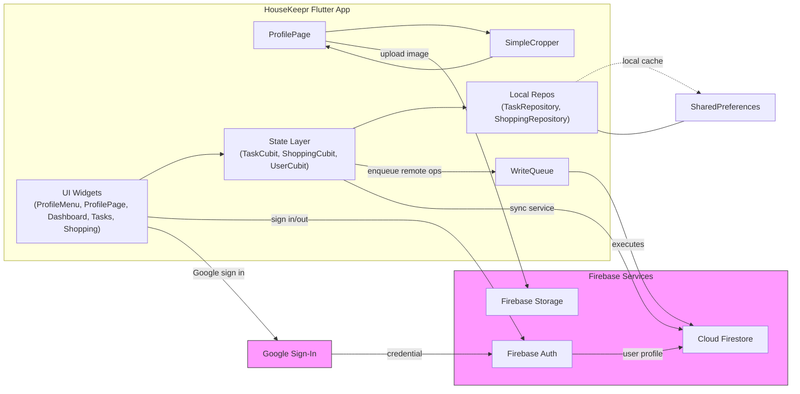

# HouseKeepr

> A cross‑platform, shared household command center built with Flutter + Firebase.

This repository contains the Flutter app plus Firebase configuration, emulator helpers, and Cloud Functions.



**Tier 2: Enhanced coordination (planned)**

- Family calendar integration
- Meal planning + recipe book

**Tier 3: Integrations & enhancements (ideas)**

- Budget tracking, shared notes/whiteboard, household info hub

### Smart integrations ecosystem (ideas)

These are exploratory directions and may change:

- Google Home / Assistant
- Philips Hue
- Spotify
- Location-specific services (e.g., transit/weather/waste collection)

## Repo layout

- `housekeepr/` — Flutter app + Firebase config (this is the directory you `cd` into for Flutter commands)
- `housekeepr/functions/` — Firebase Cloud Functions
- `housekeepr/scripts/` — helper scripts (emulator runner, run-with-firebase, etc.)

## Getting started (developer)

### Prerequisites

- Flutter (Dart SDK is constrained by `housekeepr/pubspec.yaml`)
- A Firebase project (or the Firebase emulators for tests)
- For emulators: Java (JRE/JDK) + Firebase CLI (`npm i -g firebase-tools`)

### Install

```powershell
Set-Location -LiteralPath .\housekeepr
flutter pub get
```

### Run

Most local runs use build-time Dart defines from a file:

```powershell
Set-Location -LiteralPath .\housekeepr
flutter run --dart-define-from-file=.env
```

If you prefer to pass values directly (example for web):

```powershell
flutter run -d chrome `
	--dart-define=FIREBASE_WEB_API_KEY=AIza... `
	--dart-define=FIREBASE_PROJECT_ID=your-project-id `
	--dart-define=FIREBASE_AUTH_DOMAIN=your-app.firebaseapp.com `
	--dart-define=FIREBASE_APP_ID=1:... `
	--dart-define=FIREBASE_MEASUREMENT_ID=G-...
```

### Run tests

Unit + widget tests:

```powershell
Set-Location -LiteralPath .\housekeepr
flutter test --reporter expanded
```

Integration tests (Firestore emulator) on Windows PowerShell:

```powershell
Set-Location -LiteralPath .\housekeepr
.\scripts\run_emulator_and_tests.ps1
```

To run a single integration test:

```powershell
.\scripts\run_emulator_and_tests.ps1 -TestPath 'test/integration/firestore_task_repository_emulator_rest_test.dart'
```

## Cloud Functions

This repo includes a Cloud Function used to join a household via an invite code.

Deploy (from `housekeepr/functions`):

```bash
cd housekeepr/functions
npm install
firebase deploy --only functions
```

## Architecture (high level)

```mermaid
flowchart LR
	subgraph App[HouseKeepr Flutter App]
		UI[UI Widgets\n(ProfileMenu, ProfilePage, Dashboard, Tasks, Shopping)]
		Cubits[State Layer\n(TaskCubit, ShoppingCubit, UserCubit)]
		Repos[Local Repos\n(TaskRepository, ShoppingRepository)]
		WriteQ[WriteQueue]
		Cropper[SimpleCropper]
	end

	subgraph Firebase[Firebase Services]
		Auth[Firebase Auth]
		Firestore[Cloud Firestore]
		Storage[Firebase Storage]
	end

	Google[Google Sign-In]

	UI --> Cubits
	Cubits --> Repos
	Cubits -->|enqueue remote ops| WriteQ
	WriteQ -->|executes| Firestore
	Repos -. local cache .-> Shared[SharedPreferences]
	Shared --- Repos
	ProfilePage --> Cropper
	Cropper --> ProfilePage

	Cubits -->|sync service| Firestore
	UI -->|sign in/out| Auth
	Auth -->|user profile| Firestore
	ProfilePage -->|upload image| Storage
	UI -->|Google sign in| Google
	Google -->|credential| Auth

	classDef ext fill:#f9f,stroke:#333,stroke-width:1px;
	class Firebase,Google ext;
```

Notes:

- Cubits are the single source of truth for UI state; sync services keep cubits synced with Firestore.
- `WriteQueue` persists operations locally (via SharedPreferences) and retries them when remote repositories/network are available.

## Deployment

Standard Flutter builds apply (Android/iOS/Desktop/Web). Example:

```powershell
Set-Location -LiteralPath .\housekeepr
flutter build web --release --dart-define-from-file=.env
```

## Contributing

- Create a feature branch, keep changes focused, and add/adjust tests when appropriate.
- Prefer the existing patterns (BLoC/Cubits, repositories, and local-first sync) over introducing new architecture.
