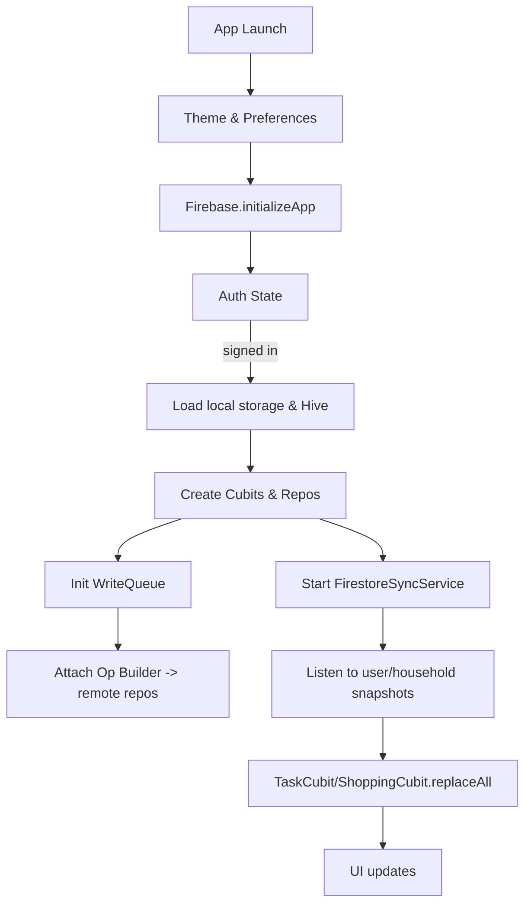

**The Team Perspective:**
- Purpose: HouseKeepr is a Flutter app for household task and grocery management. It provides optimistic local updates with background sync to Firestore so users can work offline and have changes committed reliably when online.

**The Developer Perspective:**
- Entry point: `lib/main.dart` — initializes Firebase, theme, local storage (Hive), `SharedPreferences`, notification and widget services, and orchestrates cubits and repositories.
- Key responsibilities in `main.dart`:
  - Initialize Firebase (`Firebase.initializeApp`) and set auth persistence for web.
  - Create and wire `TaskCubit`, `ShoppingCubit`, repositories, `WriteQueue`, and `FirestoreSyncService`.
  - Attach `WriteQueue` op builder that converts persisted `QueueOp` into concrete remote repo operations.
  - Start `FirestoreSyncService.start(userId, taskCubit, shoppingCubit, householdId)` to listen to server snapshots.

- Important signatures (Dart):
  - `Future<_HouseholdInitData> _initialize()` — builds cubits, repos, write queue, and starts sync.
  - `WriteQueue.attachOpBuilder(AsyncOp Function(QueueOp op)? builder)` — registers persistence-to-async mapping.
  - `FirestoreSyncService.start(String userId, TaskCubit taskCubit, ShoppingCubit shoppingCubit, {String? householdId})`

**Function Catalog:**
- `main(): Future<void>` — Application entrypoint that initializes Flutter bindings, Firebase, and the theme controller, then calls `runApp()`.
  Side effects: initializes Firebase, may write to logs, and launches the widget tree.
- `_HouseholdAppState._initialize(): Future<_HouseholdInitData>` — Performs household initialization: opens Hive boxes, initializes services (notifications, widget service), creates cubits and repositories, configures the `WriteQueue` op builder, and starts the `FirestoreSyncService`.
  Side effects: opens local storage, writes to `SharedPreferences`, and starts background sync listeners.
- `WriteQueue.attachOpBuilder(AsyncOp Function(QueueOp op)? builder): void` — Attach a builder mapping persisted `QueueOp` objects to concrete remote repository calls and resume processing.
  Side effects: may start queue processing and trigger remote repository calls.
- `FirestoreSyncService.start(String userId, TaskCubit taskCubit, ShoppingCubit shoppingCubit, {String? householdId}): Future<void>` — Start Firestore snapshot listeners for user/household tasks and groceries and merge snapshots into cubits.
  Side effects: registers Firestore listeners and updates cubit state.

**The Designer Perspective:**
- UX guarantees: local UI updates are immediate; the app shows clear loading states when checking household membership and during initialization.
- Error flows: initialization errors surface a retry UI; sync failures are handled silently or surfaced via configured failure handlers.

**Visual Mapping:**

