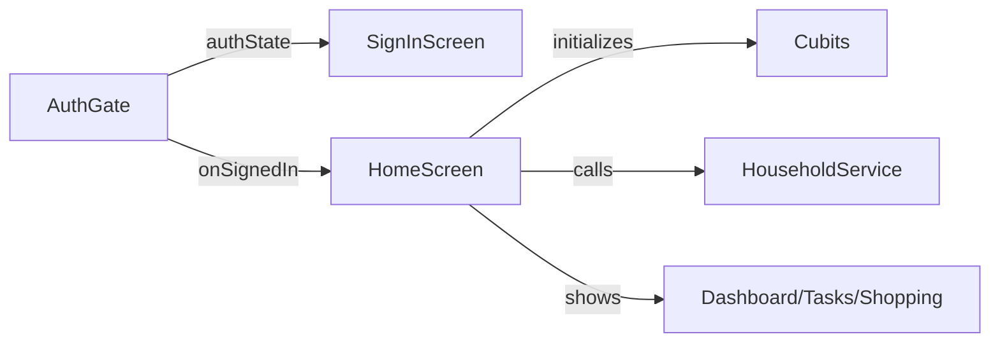

**Team Perspective**
- **Purpose:** Top-level app wiring and shell: the `AuthGate` chooses between authentication UI and the `HomeScreen`, which is the main navigation shell and orchestrator for app-wide subsystems.

**Developer Perspective**
- **Language:** Dart (Flutter)
- **Location:** `lib/auth_gate.dart`, `lib/home_screen.dart`

`AuthGate` (auth_gate.dart)
- Stateless widget that listens to `FirebaseAuth.instance.authStateChanges()` and shows `SignInScreen` (from `firebase_ui_auth`) when unauthenticated or `HomeScreen` when signed in.
- Public API: `AuthGate({required String googleWebClientId})` — supplies the web OAuth client ID used by the Google provider.

`HomeScreen` (home_screen.dart)
- Stateful main app shell exposing tabbed navigation (Dashboard, Tasks, Shopping). Key behavior:
  - Initializes and warms up Cubit state (`TaskCubit`, `ShoppingCubit`) on startup.
  - Loads `householdId` via `HouseholdService` and rebuilds child pages when resolved.
  - Manages bottom/floating navigation UI and wide-screen rail layout.
  - Exposes `selectTab(HomeTab)` to programmatically switch tabs.
  - Persists UI preferences via `SettingsRepository` (floating nav) and checks for in-app updates on Android.

Side Effects
- `AuthGate` and `HomeScreen` are UI orchestrators; they call services (`HouseholdService`, `SettingsRepository`, `InAppUpdate`) and rely on cubits for data. They do not perform direct persistence beyond using services and repositories.

Designer Perspective
- `AuthGate` defines the app's entry UX (sign-in vs signed-in). `HomeScreen` defines the primary navigation and how content is laid out across screen sizes — it must smoothly host `IndexedStack` children and surface consistent navigation affordances (floating vs classic nav).

Visual Mapping

