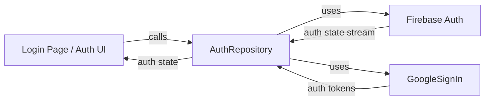

**Team Perspective**
- **Purpose:** Provides authentication operations used by the app (email/password and Google sign-in) and exposes the current user and auth state stream.

**Developer Perspective**
- **Language:** Dart (Flutter)
- **Location:** `lib/auth/auth_repository.dart`

Function Catalog
- **`AuthRepository(FirebaseAuth, GoogleSignIn)`**: constructor — creates an instance wired to platform auth providers.
- **`auth: FirebaseAuth`**: getter — returns the underlying `FirebaseAuth` instance.
- **`userChanges: Stream<User?>`**: getter — emits auth state changes from Firebase.
- **`currentUser: User?`**: getter — returns the current signed-in `User` or `null`.
- **`signInWithEmail(String email, String password): Future<UserCredential>`**: signs in using email/password via Firebase.
  - Side effects: network call to Firebase Auth; may throw `FirebaseAuthException`.
- **`registerWithEmail(String email, String password): Future<UserCredential>`**: creates a new user account with Firebase.
  - Side effects: network call and account creation.
- **`signInWithGoogle(): Future<UserCredential?>`**: starts Google Sign-In flow and exchanges tokens for Firebase credentials.
  - Side effects: launches Google Sign-In UI (user interactive), exchanges tokens with Firebase; may return `null` if user cancels.
- **`signOut(): Future<void>`**: signs out of Firebase and attempts to sign out of the GoogleSignIn client.
  - Side effects: clears local auth state and invalidates tokens; may throw, but Google sign-out errors are caught and ignored.

Designer Perspective
- **User flows:**
  - Sign in with email/password: synchronous form submit → success navigates to household/home flows, failure shows error.
  - Sign in with Google: opens Google account chooser; cancellation returns no credential.
  - Sign out: returns user to unauthenticated flows (login/join screens).
  - Loading/error states should surface while network calls are in-flight or when exceptions occur.

Visual Mapping

