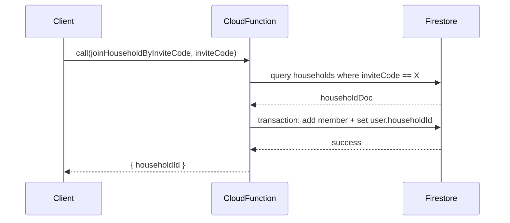

**The Team Perspective:**
- Purpose: Cloud Functions implement server-side operations that require privileged access or multi-document transactions (e.g., joining a household by invite code).

**The Developer Perspective:**
- `functions/index.js` exports `joinHouseholdByInviteCode` — a callable HTTPS function.
  - Validates `context.auth` and the `inviteCode` string.
  - Queries `households.where('inviteCode', '==', inviteCode).limit(1)`.
  - If found, runs a Firestore transaction that:
    - Adds the calling user's `uid` to `household.members` using `arrayUnion`.
    - Sets `users/<uid>.householdId = <householdId>` (merge).
  - Returns `{ householdId }` on success.

**Function Catalog:**
- `joinHouseholdByInviteCode(data: any, context: functions.https.CallableContext): Promise<{ householdId: string }>` — Callable Cloud Function that validates the caller is authenticated, verifies the provided `inviteCode`, and performs an atomic transaction to add the caller to the household's `members` array and update the user's `householdId`.
  Side effects: modifies documents in Firestore (`households/{householdId}` and `users/{uid}`).

- Client call example (Firebase JS):
```js
const joinFn = getFunctions();
const join = httpsCallable(joinFn, 'joinHouseholdByInviteCode');
const res = await join({ inviteCode: 'abcd' });
console.log(res.data.householdId);
```

**The Designer Perspective:**
- On success, the client should navigate to the household view and refresh local state. On failure (invalid code / not found), show a clear error.

**Visual Mapping:**
