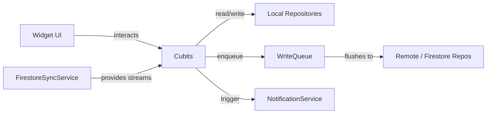

**Team Perspective**
- **Purpose:** Cubits implement local application state and orchestration between repositories, services, and the UI. They provide observable state and side-effecting operations (persistence, notifications, enqueueing remote ops).

**Developer Perspective**
- **Language:** Dart (Flutter / flutter_bloc)
- **Location:** `lib/cubits/`

Function Catalog (grouped by cubit)
- **`AuthCubit(AuthRepository repo)`**
  - `signInWithGoogle(): Future<void>` — starts Google sign-in flow and emits loading/failure states.
  - `signOut(): Future<void>` — signs out via `AuthRepository` and emits unauthenticated state.

- **`UserCubit(User?)`**
  - `setUser(User? user)` — simple setter to emit the provided Firebase `User`.

- **`ShoppingCubit` (legacy: `shopping_cubit.dart`)**
  - `load()` — loads items from local `ShoppingRepository` and emits state.
  - `addItem(ShoppingItem)` / `updateItem(ShoppingItem)` / `deleteItem(String id)` — update local store and optionally enqueue remote ops via `WriteQueue` or call `RemoteShoppingRepository`.
  - `replaceAll(List<ShoppingItem>)`, `reorderItems(...)` — local replacements and reordering.
  - `attachWriteQueue(WriteQueue?)`, `setRemoteRepository(RemoteShoppingRepository?)`, `subscribeToShoppingStream(Stream<QuerySnapshot>)` — integration points for sync.
  - `removeLocalItem` / `restoreItemFromMap` — rollback/restore helpers used by write-queue failure handling.

- **`ShoppingCubit` (v2: `shopping_cubit_v2.dart`)**
  - `addItem(String name, {note, category})` — normalizes name, auto-categorizes, persists, and enqueues remote op.
  - `toggleItem(String id)`, `cycleQuantity(String id)`, `updateQuantity(String id, int)`, `deleteItem(String id)` — item mutations that persist and enqueue.
  - `reorderItem`, `updateItemName`, `updateCategory`, `toggleAisleMode`, `toggleFlatView`, `clearCheckedItems` — UI and persistence helpers.
  - `attachWriteQueue(WriteQueue)`, `syncRemoteItems(List<GroceryItem>)` — sync integration.

- **`TaskCubit`**
  - `load()` / `loadMore()` — initialize tasks and incremental pagination.
  - `addTask(Task)`, `updateTask(Task)`, `deleteTask(String)`, `replaceAll(List<Task>)` — local persistence and remote enqueueing via `WriteQueue` or `RemoteTaskRepository` depending on `SyncMode`.
  - `archiveTask`, `bulkDelete`, `bulkArchive` — bulk operations with enqueueing semantics.
  - `subscribeToTasksStream(Stream<QuerySnapshot>)`, `setRemoteRepository(RemoteTaskRepository?)` — sync integration.
  - `attachWriteQueueAndHistory(WriteQueue?, HistoryRepository?)` — attach supporting services and restore pending deletes.
  - Occurrence helpers: `completeOccurrence`, `uncompleteOccurrence` — update completion state and history repository.
  - Sync helpers: `markTaskSyncFailed`, `retryTask`, `retryAllFailed` — manual retry/failure handling.

States
- States are immutable `Equatable` classes providing minimal fields for UI rendering (e.g., list of items/tasks, loading flags, pagination booleans, error messages).

Side Effects
- Cubits perform local persistence via repository APIs, enqueue remote operations onto `WriteQueue`, call `Remote*Repository` for direct remote calls, and schedule notifications via `NotificationService`.

Designer Perspective
- Cubits decouple UI from persistence and sync complexity:
  - UI listens to cubit states and shows loading/error/empty states.
  - Cubits provide optimistic UI updates (emit before persistence) and rollback helpers for failure handling.

Visual Mapping

