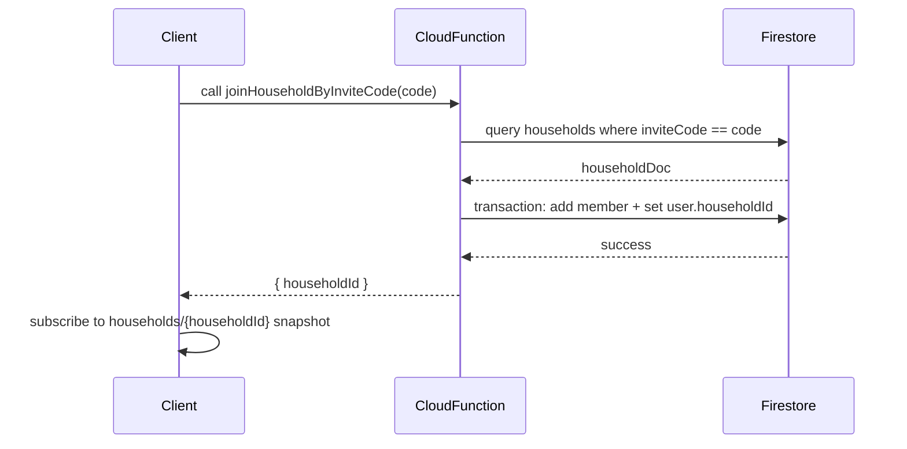

**The Team Perspective:**
- Purpose: Define the `households` Firestore schema and recommend a secure invite/join flow. This ensures membership, shared tasks, and groceries are modeled for easy syncing and clear security boundaries.

**The Developer Perspective:**
- Top-level collection: `households`
  - Document id: `householdId` (string)
  - Fields:
    - `name` (string) — human-friendly household name
    - `createdBy` (string) — UID of the user who created the household
    - `members` (array<string>) — list of member UIDs
    - `inviteCode` (string, optional) — short invite token
    - `inviteExpiresAt` (timestamp, optional) — invite expiry time
    - `createdAt` (timestamp) — creation time

- Example document:

```json
{
  "name": "The Smiths",
  "createdBy": "uid-alice",
  "members": ["uid-alice", "uid-bob"],
  "inviteCode": "ABC123",
  "inviteExpiresAt": "2026-10-31T00:00:00Z",
  "createdAt": "2026-04-08T12:00:00Z"
}
```

- Recommended per-household subcollections (used in the app):
  - `households/{householdId}/tasks` — household-scoped `Task` documents
  - `households/{householdId}/groceries` — shared grocery items
  - (optional) `households/{householdId}/rewards` — reward cards or metadata

- Invite / join flow (recommended: server-side)
  1. User opens invite link containing a code.
  2. Client calls a trusted Cloud Function (the repo includes `joinHouseholdByInviteCode`) with the invite code and auth context.
  3. The function validates the code and expiry, then runs a transaction that atomically appends the caller UID to `households/{householdId}.members` and writes `users/{uid}.householdId`.
  4. Client observes the updated household doc and enters the household context.

- Why server-side? Server-side joins keep security rules simple and prevent clients from appending arbitrary UIDs or tampering with other household fields.

**Suggested Firestore security rules (starter)**
- These rules intentionally prevent unauthenticated or non-member clients from adding themselves to `members`. Prefer server-side join logic.

```js
rules_version = '2';
service cloud.firestore {
  match /databases/{database}/documents {

    function isSignedIn() {
      return request.auth != null;
    }

    match /households/{householdId} {
      // Create: any signed-in user may create a household with themselves as creator
      allow create: if isSignedIn()
                     && request.resource.data.createdBy == request.auth.uid
                     && request.resource.data.name is string;

      // Read: only members may read household document
      allow get, list: if isSignedIn() && (request.auth.uid in resource.data.members);

      // Update: only existing members can update household metadata
      // Do NOT allow arbitrary non-members to append to members array.
      allow update: if isSignedIn() && (request.auth.uid in resource.data.members);

      // Delete: only the creator may delete the household
      allow delete: if isSignedIn() && request.auth.uid == resource.data.createdBy;

      // Subcollections: require membership to read/write. For stricter control,
      // validate content shapes per-subcollection.
      match /{subCollection=**} {
        allow read, write: if isSignedIn() && (
          // Parent doc must include member list; using get() is more robust in
          // production: get(/databases/$(database)/documents/households/$(householdId)).data.members
          request.auth.uid in resource.data.members
        );
      }
    }
  }
}
```

Notes:
- If you must support client-side joining, the rules must strictly verify that the only mutation is adding `request.auth.uid` to `members` and that no other fields change. This is error-prone — prefer the server-side flow.
- The production rules should use `get()` to read the parent document from subcollection rules to check membership reliably.

**Indexes & performance:**
- A single-field query on `inviteCode` (e.g., `where('inviteCode', '==', code).limit(1)`) usually does not need a custom index. Monitor and add indexes if multi-field queries become common.
- If inviteCode lookups become a hotspot, consider a normalized lookup collection mapping `inviteCode -> householdId`.

**The Designer Perspective:**
- UX guidance:
  - Show a clear error when an invite code is invalid or expired.
  - After successful join, transition to the household home and show a short onboarding or “who’s in this household” screen.
  - Provide a retry and help link when join errors occur (e.g., permission issues).

**Visual Mapping:**

