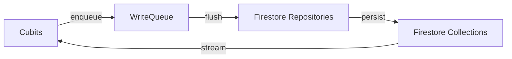
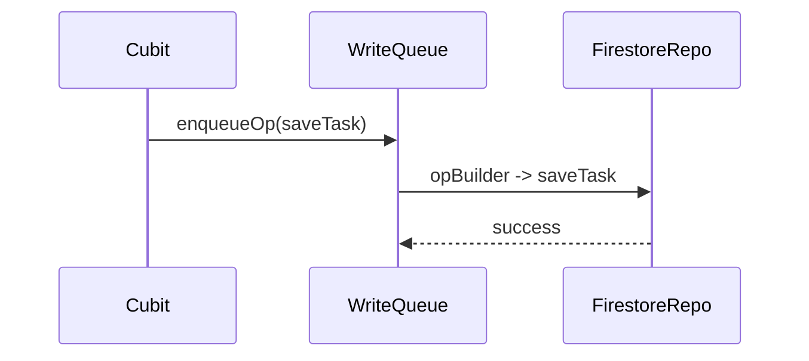

**Team Perspective**
- **Purpose:** Remote adapters that map domain models to Firestore collections and provide streaming access where applicable (homes). They are the primary server-side persistence layer.

**Developer Perspective**
- **Language:** Dart
- **Location:** `lib/firestore/`

Function Catalog
- **`FirestoreGroceryRepository(firestore, userId)`**
  - `loadItems(): Future<List<GroceryItem>>`, `saveItem(GroceryItem)`, `deleteItem(String)` — map `users/{userId}/groceries`.
  - Side effects: sets `serverUpdateTimestamp` FieldValue.serverTimestamp() on writes.

- **`FirestoreShoppingRepository(firestore, userId)`** (implements `RemoteShoppingRepository`)
  - `loadItems()`, `saveItem(ShoppingItem)`, `deleteItem(String)` — map `users/{userId}/shopping` and set server timestamps on writes.

- **`FirestoreTaskRepository(firestore, userId)`** (implements `RemoteTaskRepository`)
  - `loadTasks(): Future<List<Task>>` — reads `users/{userId}/tasks`, surfaces `serverUpdateTimestamp` as `lastSyncedAt` and a numeric `serverVersion`.
  - `saveTask(Task)`, `deleteTask(String)` — convert deadlines to `Timestamp` and set `serverUpdateTimestamp` for conflict heuristics.

- **`FirestoreHouseholdGroceryRepository` & `FirestoreHouseholdTaskRepository`**
  - Equivalent to per-user repositories but scoped under `households/{householdId}/...` for household-shared grocery and task collections.

- **`FirestoreHistoryRepository`**
  - `saveRecord(CompletionRecord)`, `deleteRecord(String)`, `loadAll()` — map `users/{userId}/history` and convert `createdAt` into `Timestamp` on write.

- **`FirestoreHomeRepository`** (implements `RemoteHomeRepository`)
  - `userHome(String userId): Stream<Home?>` — stream the household for a user by querying `households` where `members` contains the user.
  - `allHomes(String userId): Stream<List<Home>>` — stream homes the user is a member of.
  - `createHome(Home)`, `getHome(String)`, `updateHome(Home)` — CRUD operations with inviteCode generation when missing.

Side Effects
- All Firestore repositories may write `serverUpdateTimestamp` and use `Timestamp` fields for deadlines/createdAt. They can rethrow caught errors so callers can handle/retry.

Designer Perspective
- Firestore repositories are the authoritative source for cross-device sync and household-level sharing. Streams (e.g., `userHome`) drive real-time UI updates in multi-device scenarios.

Visual Mapping

**The Team Perspective:**
- Purpose: Firestore repository classes encapsulate read/write operations to Firestore for tasks, groceries, and history so higher-level cubits remain storage-agnostic.

**The Developer Perspective:**
- Example interface (conceptual):
  - `abstract class RemoteTaskRepository { Future<List<Task>> loadTasks(); Future<void> saveTask(Task task); Future<void> deleteTask(String id); }`
- Example implementation: `FirestoreTaskRepository` (Dart)
  - Constructor: `FirestoreTaskRepository(FirebaseFirestore firestore, {required String userId})`
  - `loadTasks()` reads `users/<userId>/tasks`, converts `serverUpdateTimestamp` -> `lastSyncedAt` and `serverVersion`.
  - `saveTask(Task task)` sets `serverUpdateTimestamp = FieldValue.serverTimestamp()` and writes to `users/<userId>/tasks/<id>` (merge=true). After write it attempts a read to surface resolved timestamp.
  - `deleteTask(String id)` deletes the document.

**Function Catalog:**
- `FirestoreTaskRepository(FirebaseFirestore firestore, {required String userId})` — Constructor that binds the repository to a Firestore instance and user id.
  Side effects: none.
- `Future<List<Task>> loadTasks()` — Fetch all task documents from `users/<userId>/tasks`, convert Firestore timestamps to model fields, and return a list of `Task` objects.
  Side effects: performs a network read.
- `Future<void> saveTask(Task task)` — Write or merge the task document into Firestore and set `serverUpdateTimestamp = FieldValue.serverTimestamp()` to let the server annotate write time.
  Side effects: performs a network write and optionally reads the written doc to surface resolved timestamps.
- `Future<void> deleteTask(String id)` — Delete the task document at `users/<userId>/tasks/<id>`.
  Side effects: performs a network delete.

**The Designer Perspective:**
- Repositories are internal; UI should rely on cubits for state. Repository read/write latency and retries are hidden behind the write-queue pattern.

**Visual Mapping:**
