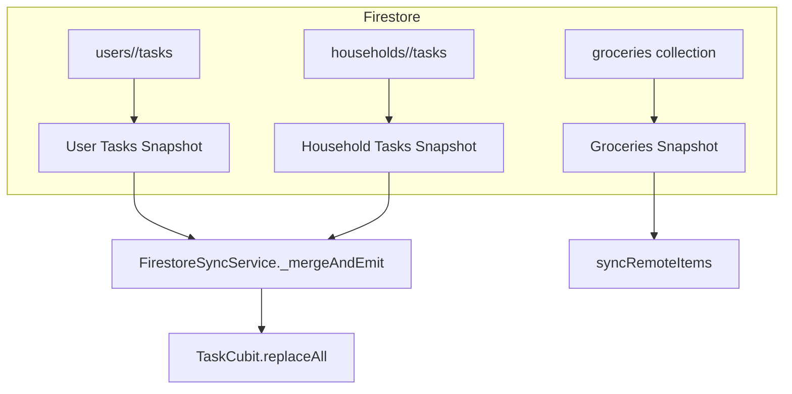

**The Team Perspective:**
- Purpose: `FirestoreSyncService` listens to real-time snapshots for both per-user and household collections, merges server state with local optimistic state, and feeds the cubits so the UI stays consistent.

**The Developer Perspective:**
- Key class and method:
  - `class FirestoreSyncService { Future<void> start(String userId, TaskCubit taskCubit, ShoppingCubit shoppingCubit, {String? householdId}) }
  - `start` sets up listeners for:
    - `users/<userId>/tasks` (user-scoped tasks)
    - `households/<householdId>/tasks` (household-scoped tasks) — if `householdId` present
    - `households/<householdId>/groceries` or `users/<userId>/groceries`
  - On snapshot, documents are mapped to models (`Task.fromMap`, `GroceryItem.fromMap`) and annotated with `serverVersion` / `lastSyncedAt` when a Firestore `Timestamp` exists.
  - `_mergeAndEmit` merges incoming server tasks with preserved local tasks and pending local-only tasks to avoid data loss (preserve tasks from the other stream and pending unsynced tasks).
  - `stop()` cancels subscriptions.

**Function Catalog:**
- `FirestoreSyncService(FirebaseFirestore firestore): FirestoreSyncService` — Constructor that stores a Firestore client instance.
  Side effects: none.
- `Future<void> start(String userId, TaskCubit taskCubit, ShoppingCubit shoppingCubit, {String? householdId})` — Starts snapshot listeners for user tasks, household tasks (if provided), and groceries, mapping docs to models and merging into cubits.
  Side effects: registers Firestore snapshot listeners which will update the `TaskCubit` and `ShoppingCubit` over time.
- `void _mergeAndEmit(TaskCubit taskCubit, {required List<Task> serverTasks, required String source, String? householdId})` — Merge incoming server tasks with local state, preserving pending local edits and tasks from the other stream, then call `taskCubit.replaceAll`.
  Side effects: replaces the task cubit's state.
- `Future<void> stop()` — Cancel all active Firestore subscriptions created by `start()`.
  Side effects: cancels network listeners and stops further updates to cubits.

- Merge heuristics summary:
  - Keep tasks from the other stream (user vs household) to avoid overwriting.
  - Keep pending local tasks whose `syncStatus != SyncStatus.synced`.
  - Overwrite with server items afterward (server wins for that id).

**The Designer Perspective:**
- Visuals should not flash or lose local edits; merges happen silently and the app keeps local pending items visible until server confirmation.
- If household permissions block a subscription, the service logs the error; consider surfacing a helpful message only if it affects user actions.

**Visual Mapping:**

