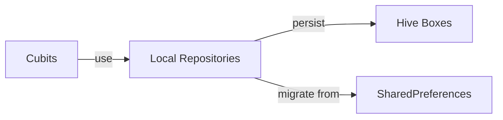

**Team Perspective**
- **Purpose:** Local persistence adapters that provide synchronous/fast access to app models and handle legacy migrations from `SharedPreferences` into `Hive` where needed.

**Developer Perspective**
- **Language:** Dart
- **Location:** `lib/repositories/`
- **Backends:** `Hive` boxes for primary storage, `SharedPreferences` for legacy migration and some config.

Function Catalog
- **`GroceryRepository`**
  - `loadItems(): List<GroceryItem>` — reads `groceries` Hive box and returns `GroceryItem` instances, applying stored `order` from `groceries_meta` when present.
  - `saveItem(GroceryItem)`, `deleteItem(String)`, `saveItems(List<GroceryItem>)` — persist operations; `updateOrder(List<String>)` manages ordering metadata.

- **`HistoryRepository`**
  - `loadAll(): List<CompletionRecord>` — returns all completion records from `history` Hive box.
  - `saveAll(List<CompletionRecord>)`, `add(CompletionRecord)`, `remove(String id)` — mutate stored history.
  - `forTaskOnDate(String taskId, String date)` — helper filter.

- **`ShoppingRepository`**
  - `loadItems(): List<ShoppingItem>` — returns items from `shopping` Hive box; performs synchronous migration from legacy `SharedPreferences` key `shopping_v1` when present.
  - `saveItems(List<ShoppingItem>)`, `createItem(...) => Future<ShoppingItem>`, `updateItem(ShoppingItem)`, `deleteItem(String)` — primary mutation APIs that maintain `shopping_meta.order`.

- **`TaskRepository`**
  - `loadTasks(): List<Task>` — reads `tasks` Hive box, migrates from legacy `tasks_v1` SharedPreferences if present.
  - `loadTasksPage({offset,limit,includeArchived})` — pagination helper used by `TaskCubit`.
  - `saveTasks(List<Task>)`, `createTask(...) => Future<Task>`, `createTaskObject(Task)`, `updateTask(Task)`, `deleteTask(String)` — persistent operations; `saveTasks` also prunes stale entries to match the provided list.

Side Effects
- Repositories write to local storage (`Hive` boxes and occasionally `SharedPreferences`) and perform background migration tasks. Some methods are synchronous for test compatibility but may kick off async migrations.

Designer Perspective
- Local repositories provide immediate data for UI rendering; expect fast reads and occasional background migrations (which should not block UI). Ordering metadata is used to maintain consistent list presentation.

Visual Mapping

