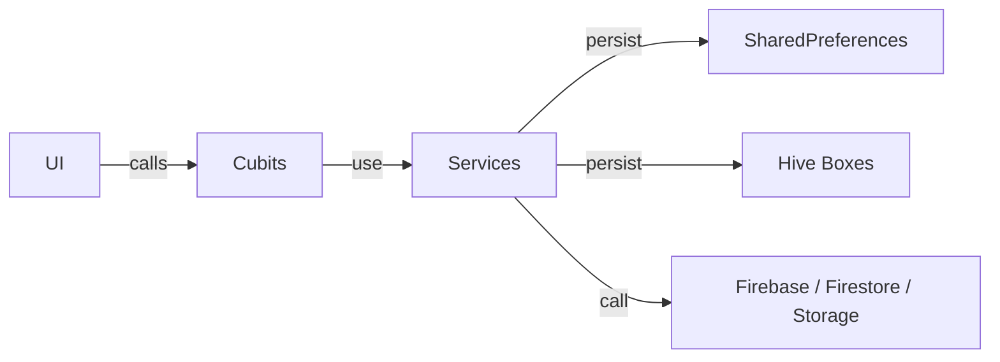

**Team Perspective**
- **Purpose:** Shared services provide cross-cutting functionality: notifications, migration, household lookup, product suggestions, theme management, and widget bridging.

**Developer Perspective**
- **Language:** Dart
- **Location:** `lib/services/`

Function Catalog
- **`HouseholdService`** (`household_service.dart`)
  - `findHouseholdForUser(String userId): Future<String?>` — finds the household containing the user by checking `users/{userId}.householdId` first and falling back to querying `households` collection. Side effects: may write `householdId` back to the user document as a migration step.

- **`MigrationService`** (`migration_service.dart`)
  - `migrateIfNeeded(String userId): Future<void>` — migrates local `Task` and `ShoppingItem` data into Firestore using provided remote repositories and sets a preferences flag to avoid repeat migrations.

- **`NotificationService`** (`notification_service.dart`)
  - Singleton `NotificationService.instance` with:
    - `init(SharedPreferences, {GlobalKey<ScaffoldMessengerState>? scaffoldKey, VoidCallback? onOpenTasks})` — initializes platform plugin (if available) and timezone data.
    - `show(String title, String body)` — in-app snackbars or debug fallback.
    - `scheduleReminder(String taskId, DateTime at, {title, body, priorityLevel})` — persists reminder and schedules platform notification when available.
    - `cancelReminder(String taskId)`, `scheduleDailyStartEnd(...)`, `checkAndFireDueReminders({DateTime? now})` — reminder lifecycle management.
  - Side effects: writes to `SharedPreferences`, interacts with `flutter_local_notifications` plugin, invokes `ScaffoldMessenger` for snackbars.

- **`ProfileApis`** (`profile_apis.dart`)
  - Lightweight platform API wrappers used by `ProfilePage`: `AuthApi`, `FirestoreApi`, `StorageApi`, `ImagePickerApi` and the `ProfileApis` aggregator.
  - Purpose: make `ProfilePage` testable by injecting fakes.

- **`recurrence_generator`** (`recurrence_generator.dart`)
  - `generateOccurrencesForTask(Task, DateTime from, DateTime to, {int interval}) -> List<DateTime>`: pure function generating occurrence dates for simple repeat rules (`daily`, `weekly`, `monthly`). No side effects.

- **`ShoppingProductsService`** (`shopping_products_service.dart`)
  - Singleton `ShoppingProductsService.instance` with:
    - `init(SharedPreferences)` — loads CSV product data and opens a Hive learning box.
    - `getProductSuggestion(String)`, `getCategoryForProduct(String)`, `learnProduct(String, GroceryCategory)` — auto-categorization and suggestion helpers.
    - Search and grouping helpers: `getSections()`, `getProductsForSection()`, `searchProducts()`, `getProductsBySection()`.
  - Side effects: persists learned mappings in a Hive box and stores CSV in `SharedPreferences`.

- **`ThemeController`** (`theme_controller.dart`)
  - Singleton `ThemeController.instance` (extends `ChangeNotifier`) with `load()`, `setTheme(AppThemeType)`, and getters for `lightScheme`/`darkScheme`.
  - Side effects: persists selection in `SharedPreferences` and notifies listeners.

- **`WidgetService`** (`widget_service.dart`)
  - Singleton used to update Android home-screen widget via `home_widget` APIs: `init()`, `updateWidget(List<GroceryItem>)`, `updateWidgetImmediate(...)`, `processPendingToggles()`, `dispose()`.
  - Side effects: writes widget JSON blob and triggers widget refresh; reads pending toggle actions produced by the widget.

Side Effects
- Services interact with platform plugins (`flutter_local_notifications`, `home_widget`), local stores (`SharedPreferences`, `Hive`), and remote Firestore. Many methods catch and swallow platform errors to remain safe in test/headless environments.

Designer Perspective
- Services provide UX features like scheduled reminders, home-screen widgets, and product auto-categorization. They are opinionated about graceful degradation when platform APIs are absent (web/tests).

Visual Mapping

