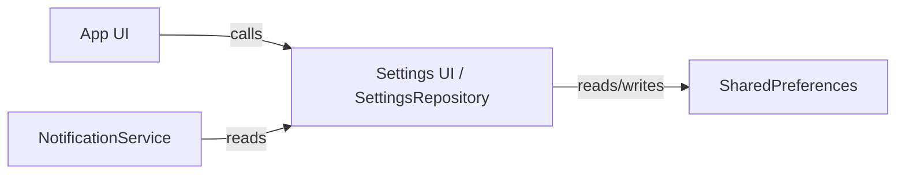

**Team Perspective**
- **Purpose:** Centralized local settings storage for small UI and sync preferences (sync mode, notification windows, UI toggles).

**Developer Perspective**
- **Language:** Dart (Flutter)
- **Location:** `lib/core/settings_repository.dart`

Function Catalog
- **`SettingsRepository(SharedPreferences prefs)`**: constructor — uses `SharedPreferences` as the backing store.
- **`getSyncMode(): SyncMode`** — reads the stored sync mode key and returns a `SyncMode` enum (via `SyncModeExtension.fromKey`).
- **`setSyncMode(SyncMode mode): Future<void>`** — persists the `SyncMode` key.
- **`notificationsEnabled(): bool`** — returns whether in-app notifications are enabled (defaults to `true`).
- **`setNotificationsEnabled(bool v): Future<void>`** — persists the value.
- **`notificationPermissionPrompted(): bool`** — whether the permission prompt was already shown (defaults to `false`).
- **`setNotificationPermissionPrompted(bool v): Future<void>`** — persists the value.
- **`notificationStart(): TimeOfDay`** — reads the stored notification start time as an `HH:mm` string and returns a `TimeOfDay` (default `07:00`).
- **`setNotificationStart(TimeOfDay t): Future<void>`** — stores the time as `HH:mm`.
- **`notificationEnd(): TimeOfDay`** — reads the stored notification end time (default `17:00`).
- **`setNotificationEnd(TimeOfDay t): Future<void>`** — stores the end time as `HH:mm`.
- **`useFloatingNav(): bool`** — reads whether the floating navigation is enabled (default `true`).
- **`setUseFloatingNav(bool v): Future<void>`** — persists the UI toggle.

Side Effects
- All setters use `SharedPreferences` and are async; they persist lightweight user preferences locally and have no network side effects.

Designer Perspective
- **User-facing settings:** sync mode choice, notification toggles and window, and the floating navigation option — changes should be persisted immediately and reflected in the UI.

Visual Mapping

