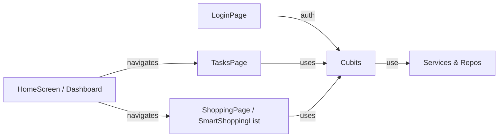
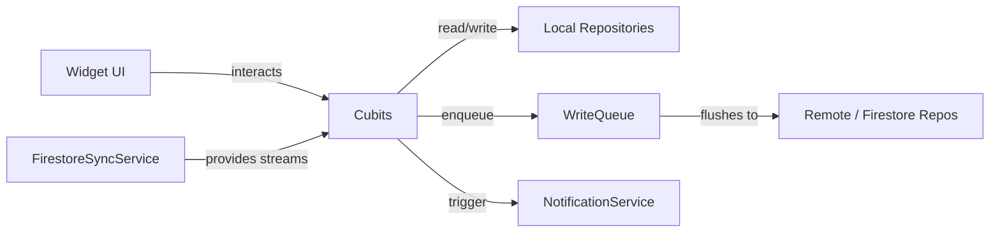

# Shopping Feature Compendium

Generated from the shopping/cart/list feature files in this repository.

## Included Files
- [lib/ui/smart_shopping_list_page.dart](lib/ui/smart_shopping_list_page.dart)
- [lib/ui/shopping_page.dart](lib/ui/shopping_page.dart)
- [lib/ui/shopping_list_item_tile.dart](lib/ui/shopping_list_item_tile.dart)
- [lib/ui/shopping_add_dialog.dart](lib/ui/shopping_add_dialog.dart)
- [lib/ui/shopping_add_product_dialog.dart](lib/ui/shopping_add_product_dialog.dart)
- [lib/cubits/shopping_cubit.dart](lib/cubits/shopping_cubit.dart)
- [lib/cubits/shopping_state.dart](lib/cubits/shopping_state.dart)
- [lib/repositories/grocery_repository.dart](lib/repositories/grocery_repository.dart)
- [lib/services/shopping_products_service.dart](lib/services/shopping_products_service.dart)
- [lib/services/widget_service.dart](lib/services/widget_service.dart)
- [lib/services/firestore_sync_service.dart](lib/services/firestore_sync_service.dart)
- [lib/main.dart](lib/main.dart)
- [lib/home_screen.dart](lib/home_screen.dart)
- [docs/ui.md](docs/ui.md)
- [docs/cubits.md](docs/cubits.md)
- [docs/models.md](docs/models.md)
- [android/app/src/main/java/com/kianhamidi/housekeepr/ShoppingListWidget.kt](android/app/src/main/java/com/kianhamidi/housekeepr/ShoppingListWidget.kt)
- [android/app/src/main/java/com/kianhamidi/housekeepr/ShoppingListRemoteViewsFactory.kt](android/app/src/main/java/com/kianhamidi/housekeepr/ShoppingListRemoteViewsFactory.kt)
- [android/app/src/main/java/com/kianhamidi/housekeepr/ShoppingListRemoteViewsService.kt](android/app/src/main/java/com/kianhamidi/housekeepr/ShoppingListRemoteViewsService.kt)

## lib/ui/smart_shopping_list_page.dart

[Open source file](lib/ui/smart_shopping_list_page.dart)

````dart
import 'package:flutter/material.dart';
import 'package:flutter_bloc/flutter_bloc.dart';
import 'package:wakelock_plus/wakelock_plus.dart';

import '../cubits/shopping_cubit.dart';
import '../models/grocery_category.dart';
import '../models/grocery_item.dart';
import '../services/shopping_products_service.dart';
import 'category_picker_dialog.dart';
import 'quantity_picker_dialog.dart';
import 'shopping_list_item_tile.dart';

class SmartShoppingListPage extends StatefulWidget {
  const SmartShoppingListPage({super.key});

  @override
  State<SmartShoppingListPage> createState() => _SmartShoppingListPageState();
}

class _SmartShoppingListPageState extends State<SmartShoppingListPage> {
  final TextEditingController _itemController = TextEditingController();
  final FocusNode _itemFocusNode = FocusNode();
  GroceryCategory _selectedCategory = GroceryCategory.other;
  bool _manualCategoryOverride = false;
  bool _showCategoryChips = false;
  String _manualOverrideText = '';
  String? _suggestedText;
  double _suggestionConfidence = 0.0;
  // Scroll FAB state
  final ScrollController _scrollController = ScrollController();
  bool _showScrollDownFab = false;
  bool _showScrollUpFab = false;
  static const Duration _fabAnimDur = Duration(milliseconds: 200);

  @override
  void initState() {
    super.initState();
    _itemController.addListener(_onTextChanged);
    _scrollController.addListener(_onScroll);
    WidgetsBinding.instance.addPostFrameCallback((_) => _updateFabVisibility());
  }

  void _onTextChanged() {
    final rawText = _itemController.text;
    if (_manualCategoryOverride && rawText != _manualOverrideText) {
      _manualCategoryOverride = false;
    }
    if (_manualCategoryOverride) return;

    final text = rawText.trim();
    if (text.isEmpty) {
      if (_selectedCategory != GroceryCategory.other ||
          _suggestedText != null) {
        setState(() {
          _selectedCategory = GroceryCategory.other;
          _suggestedText = null;
          _suggestionConfidence = 0.0;
        });
      }
      return;
    }

    final suggestion = ShoppingProductsService.instance.getProductSuggestion(
      text,
    );
    final nextSuggestedText = suggestion?.product;
    final nextSuggestionConfidence = suggestion?.confidence ?? 0.0;

    final learned = ShoppingProductsService.instance.getCategoryForProduct(
      text,
    );
    final nextCategory = learned ?? _selectedCategory;
    if (nextCategory != _selectedCategory ||
        nextSuggestedText != _suggestedText ||
        nextSuggestionConfidence != _suggestionConfidence) {
      setState(() {
        if (learned != null) {
          _selectedCategory = learned;
        }
        _suggestedText = nextSuggestedText;
        _suggestionConfidence = nextSuggestionConfidence;
      });
    }
  }

  @override
  void dispose() {
    _itemController.removeListener(_onTextChanged);
    _itemController.dispose();
    _itemFocusNode.dispose();
    _scrollController.dispose();
    // Disable wake lock when leaving the page
    WakelockPlus.disable();
    super.dispose();
  }

  void _onScroll() {
    if (!_scrollController.hasClients) return;
    final max = _scrollController.position.maxScrollExtent;
    final offset = _scrollController.offset;

    // If there's nothing to scroll, hide both
    if (max <= 0) {
      if (_showScrollDownFab || _showScrollUpFab) {
        setState(() {
          _showScrollDownFab = false;
          _showScrollUpFab = false;
        });
      }
      return;
    }

    final atBottom = offset >= (max - 24.0);

    if (atBottom) {
      if (!_showScrollUpFab || _showScrollDownFab) {
        setState(() {
          _showScrollUpFab = true;
          _showScrollDownFab = false;
        });
      }
    } else {
      if (!_showScrollDownFab || _showScrollUpFab) {
        setState(() {
          _showScrollDownFab = true;
          _showScrollUpFab = false;
        });
      }
    }
  }

  void _updateFabVisibility() {
    if (!_scrollController.hasClients) return;
    final max = _scrollController.position.maxScrollExtent;
    final offset = _scrollController.offset;
    if (max > 50 && offset < (max - 24.0)) {
      setState(() {
        _showScrollDownFab = true;
        _showScrollUpFab = false;
      });
    } else {
      setState(() {
        _showScrollDownFab = false;
        _showScrollUpFab = false;
      });
    }
  }

  void _addItem() {
    final text = _toPascalCase(_itemController.text);
    if (text.isEmpty) return;

    context.read<ShoppingCubit>().addItem(text, category: _selectedCategory);

    _itemController.clear();
    _selectedCategory = GroceryCategory.other;
    _manualCategoryOverride = false;
    _manualOverrideText = '';
    _suggestedText = null;
    _suggestionConfidence = 0.0;
    _itemFocusNode.requestFocus();
  }

  String _toPascalCase(String input) {
    final collapsed = input.trim().replaceAll(RegExp(r'\s+'), ' ');
    if (collapsed.isEmpty) return '';
    return collapsed
        .split(' ')
        .where((word) => word.isNotEmpty)
        .map(
          (word) => word.length == 1
              ? word.toUpperCase()
              : '${word[0].toUpperCase()}${word.substring(1)}',
        )
        .join(' ');
  }

  @override
  Widget build(BuildContext context) {
    final isMobile = MediaQuery.of(context).size.width < 600;

    return BlocListener<ShoppingCubit, ShoppingState>(
      listenWhen: (prev, curr) =>
          prev.aisleModeEnabled != curr.aisleModeEnabled,
      listener: (context, state) {
        if (state.aisleModeEnabled) {
          WakelockPlus.enable();
        } else {
          WakelockPlus.disable();
        }
      },
      child: Scaffold(
        resizeToAvoidBottomInset: false,
        appBar: AppBar(
          title: const Text('Shopping List'),
          elevation: 0,
          actions: [
            BlocBuilder<ShoppingCubit, ShoppingState>(
              builder: (context, state) {
                final checkedCount = state.items.where((i) => i.checked).length;
                return Padding(
                  padding: const EdgeInsets.symmetric(horizontal: 16),
                  child: Center(
                    child: Text(
                      '${state.items.length - checkedCount}',
                      style: Theme.of(context).textTheme.titleLarge,
                    ),
                  ),
                );
              },
            ),
            BlocBuilder<ShoppingCubit, ShoppingState>(
              builder: (context, state) => PopupMenuButton(
                onSelected: (value) {
                  if (value == 'clear') {
                    context.read<ShoppingCubit>().clearCheckedItems();
                  } else if (value == 'mode') {
                    context.read<ShoppingCubit>().toggleAisleMode();
                  } else if (value == 'flat') {
                    context.read<ShoppingCubit>().toggleFlatView();
                  }
                },
                itemBuilder: (context) => [
                  PopupMenuItem(
                    value: 'mode',
                    child: Row(
                      children: [
                        Icon(
                          state.aisleModeEnabled
                              ? Icons.check_box
                              : Icons.check_box_outline_blank,
                          size: 20,
                        ),
                        const SizedBox(width: 8),
                        Text(
                          state.aisleModeEnabled
                              ? 'Aisle Mode: On'
                              : 'Aisle Mode: Off',
                        ),
                      ],
                    ),
                  ),
                  PopupMenuItem(
                    value: 'flat',
                    child: Row(
                      children: [
                        Icon(
                          state.flatViewEnabled
                              ? Icons.check_box
                              : Icons.check_box_outline_blank,
                          size: 20,
                        ),
                        const SizedBox(width: 8),
                        Text(
                          state.flatViewEnabled
                              ? 'Flat View: On'
                              : 'Flat View: Off',
                        ),
                      ],
                    ),
                  ),
                  const PopupMenuItem(
                    value: 'clear',
                    child: Text('Clear Checked Items'),
                  ),
                ],
              ),
            ),
          ],
        ),
        body: GestureDetector(
          behavior: HitTestBehavior.translucent,
          onTap: () => FocusScope.of(context).unfocus(),
          child: SafeArea(
            child: Column(
              children: [
                // Quick Add Section
                _buildQuickAddSection(context, isMobile),
                const SizedBox(height: 8),

                // Shopping List
                Expanded(
                  child: BlocBuilder<ShoppingCubit, ShoppingState>(
                    builder: (context, state) {
                      if (state.items.isEmpty) {
                        return const Center(
                          child: Text('No items yet. Start adding!'),
                        );
                      }

                      // Group items by category (for unchecked items)
                      final uncheckedItems = state.items
                          .where((i) => !i.checked)
                          .toList();
                      final checkedItems = state.items
                          .where((i) => i.checked)
                          .toList();

                      final categories = <GroceryCategory, List<GroceryItem>>{};
                      for (final item in uncheckedItems) {
                        categories.putIfAbsent(item.category, () => []);
                        categories[item.category]!.add(item);
                      }

                      // For flat view: sort by creation time (newest first)
                      final flatSortedItems = List<GroceryItem>.from(
                        uncheckedItems,
                      )..sort((a, b) => b.createdAt.compareTo(a.createdAt));

                      return Stack(
                        children: [
                          NotificationListener<ScrollNotification>(
                            onNotification: (notification) {
                              if (notification is ScrollStartNotification ||
                                  notification is UserScrollNotification) {
                                FocusScope.of(context).unfocus();
                                if (_showScrollDownFab || _showScrollUpFab) {
                                  setState(() {
                                    _showScrollDownFab = false;
                                    _showScrollUpFab = false;
                                  });
                                }
                              }
                              return false;
                            },
                            child: CustomScrollView(
                              controller: _scrollController,
                              slivers: [
                                // Unchecked items - flat or grouped
                                if (state.flatViewEnabled)
                                  // Flat view: single list without category headers
                                  SliverList(
                                    delegate: SliverChildBuilderDelegate((
                                      context,
                                      index,
                                    ) {
                                      final item = flatSortedItems[index];
                                      return ShoppingListItemTile(
                                        item: item,
                                        aisleMode: state.aisleModeEnabled,
                                        onCheck: () => context
                                            .read<ShoppingCubit>()
                                            .toggleItem(item.id),
                                        onDelete: () => context
                                            .read<ShoppingCubit>()
                                            .deleteItem(item.id),
                                        onQuantity: () => context
                                            .read<ShoppingCubit>()
                                            .cycleQuantity(item.id),
                                        onQuantityLongPress: () async {
                                          final newQty =
                                              await showQuantityPickerDialog(
                                                context,
                                                currentQuantity: item.quantity,
                                              );
                                          if (newQty != null &&
                                              context.mounted) {
                                            context
                                                .read<ShoppingCubit>()
                                                .updateQuantity(
                                                  item.id,
                                                  newQty,
                                                );
                                          }
                                        },
                                        onLongPress: () async {
                                          final newCat =
                                              await showCategoryPickerDialog(
                                                context,
                                                currentCategory: item.category,
                                              );
                                          if (newCat != null &&
                                              context.mounted) {
                                            context
                                                .read<ShoppingCubit>()
                                                .updateCategory(
                                                  item.id,
                                                  newCat,
                                                );
                                          }
                                        },
                                      );
                                    }, childCount: flatSortedItems.length),
                                  )
                                else
                                  // Grouped by category
                                  ...categories.entries.map((entry) {
                                    final category = entry.key;
                                    final items = entry.value;
                                    return _buildCategorySection(
                                      context,
                                      category,
                                      items,
                                      state.aisleModeEnabled,
                                    );
                                  }),

                                // Checked items section
                                if (checkedItems.isNotEmpty)
                                  SliverToBoxAdapter(
                                    child: Padding(
                                      padding: const EdgeInsets.only(top: 16),
                                      child: _buildCompletedHeader(
                                        checkedItems.length,
                                      ),
                                    ),
                                  ),
                                if (checkedItems.isNotEmpty)
                                  SliverList(
                                    delegate: SliverChildBuilderDelegate(
                                      (context, index) => ShoppingListItemTile(
                                        item: checkedItems[index],
                                        aisleMode: state.aisleModeEnabled,
                                        onCheck: () => context
                                            .read<ShoppingCubit>()
                                            .toggleItem(checkedItems[index].id),
                                        onDelete: () => context
                                            .read<ShoppingCubit>()
                                            .deleteItem(checkedItems[index].id),
                                        onQuantity: () => context
                                            .read<ShoppingCubit>()
                                            .cycleQuantity(
                                              checkedItems[index].id,
                                            ),
                                        onQuantityLongPress: () async {
                                          final newQty =
                                              await showQuantityPickerDialog(
                                                context,
                                                currentQuantity:
                                                    checkedItems[index]
                                                        .quantity,
                                              );
                                          if (newQty != null &&
                                              context.mounted) {
                                            context
                                                .read<ShoppingCubit>()
                                                .updateQuantity(
                                                  checkedItems[index].id,
                                                  newQty,
                                                );
                                          }
                                        },
                                        onLongPress: () async {
                                          final newCat =
                                              await showCategoryPickerDialog(
                                                context,
                                                currentCategory:
                                                    checkedItems[index]
                                                        .category,
                                              );
                                          if (newCat != null &&
                                              context.mounted) {
                                            context
                                                .read<ShoppingCubit>()
                                                .updateCategory(
                                                  checkedItems[index].id,
                                                  newCat,
                                                );
                                          }
                                        },
                                      ),
                                      childCount: checkedItems.length,
                                    ),
                                  ),
                                const SliverSafeArea(
                                  sliver: SliverToBoxAdapter(
                                    child: SizedBox(height: 16),
                                  ),
                                ),
                              ],
                            ),
                          ),

                          // Scroll Down FAB (appears when not at bottom)
                          Positioned(
                            right: 16,
                            bottom: 16,
                            child: AnimatedSlide(
                              duration: _fabAnimDur,
                              offset: _showScrollDownFab
                                  ? Offset.zero
                                  : const Offset(0, 1),
                              child: AnimatedOpacity(
                                duration: _fabAnimDur,
                                opacity: _showScrollDownFab ? 1.0 : 0.0,
                                child: FloatingActionButton(
                                  heroTag: 'scrollDownFab',
                                  onPressed: () async {
                                    setState(() => _showScrollDownFab = false);
                                    await _scrollController.animateTo(
                                      _scrollController
                                          .position
                                          .maxScrollExtent,
                                      duration: const Duration(
                                        milliseconds: 420,
                                      ),
                                      curve: Curves.easeOut,
                                    );
                                    if (context.mounted) {
                                      setState(() {
                                        _showScrollUpFab = true;
                                        _showScrollDownFab = false;
                                      });
                                    }
                                  },
                                  child: const Icon(Icons.arrow_downward),
                                ),
                              ),
                            ),
                          ),

                          // Scroll Up FAB (appears when at bottom)
                          Positioned(
                            right: 16,
                            top: 16,
                            child: AnimatedSlide(
                              duration: _fabAnimDur,
                              offset: _showScrollUpFab
                                  ? Offset.zero
                                  : const Offset(0, -1),
                              child: AnimatedOpacity(
                                duration: _fabAnimDur,
                                opacity: _showScrollUpFab ? 1.0 : 0.0,
                                child: FloatingActionButton(
                                  heroTag: 'scrollUpFab',
                                  onPressed: () async {
                                    setState(() => _showScrollUpFab = false);
                                    await _scrollController.animateTo(
                                      0.0,
                                      duration: const Duration(
                                        milliseconds: 420,
                                      ),
                                      curve: Curves.easeOut,
                                    );
                                    if (context.mounted) {
                                      setState(() {
                                        _showScrollDownFab =
                                            _scrollController
                                                .position
                                                .maxScrollExtent >
                                            50;
                                        _showScrollUpFab = false;
                                      });
                                    }
                                  },
                                  child: const Icon(Icons.arrow_upward),
                                ),
                              ),
                            ),
                          ),
                        ],
                      );
                    },
                  ),
                ),
              ],
            ),
          ),
        ),
      ),
    );
  }

  Widget _buildQuickAddSection(BuildContext context, bool isMobile) {
    const inputPadding = EdgeInsets.symmetric(horizontal: 16, vertical: 12);
    final inputTextStyle = Theme.of(context).textTheme.bodyLarge;

    final currentText = _itemController.text;
    final suggestionLower = _suggestedText?.toLowerCase();
    final currentLower = currentText.toLowerCase();

    final showGhost =
        _suggestedText != null &&
        currentLower.isNotEmpty &&
        suggestionLower != null &&
        suggestionLower.startsWith(currentLower);

    if (showGhost && _suggestedText != null) {
      _suggestedText =
          currentText + _suggestedText!.substring(currentLower.length);
    }

    return Padding(
      padding: const EdgeInsets.all(16),
      child: Column(
        crossAxisAlignment: CrossAxisAlignment.start,
        children: [
          Stack(
            children: [
              if (showGhost)
                IgnorePointer(
                  child: TextField(
                    controller: TextEditingController(text: _suggestedText),
                    style: inputTextStyle?.copyWith(
                      color: Theme.of(context).hintColor.withValues(alpha: 0.5),
                    ),
                    decoration: InputDecoration(
                      // Match the decoration EXACTLY
                      border: OutlineInputBorder(
                        borderRadius: BorderRadius.circular(12),
                        borderSide: const BorderSide(color: Colors.transparent),
                      ),
                      enabledBorder: OutlineInputBorder(
                        borderRadius: BorderRadius.circular(12),
                        borderSide: const BorderSide(color: Colors.transparent),
                      ),
                      contentPadding: inputPadding,
                    ),
                  ),
                ),

              // ACTUAL INPUT LAYER
              Focus(
                onFocusChange: (hasFocus) {
                  if (_showCategoryChips != hasFocus) {
                    setState(() => _showCategoryChips = hasFocus);
                  }
                },
                child: TextField(
                  controller: _itemController,
                  focusNode: _itemFocusNode,
                  style: inputTextStyle,
                  onTap: () {
                    if (showGhost && currentText != _suggestedText) {
                      _itemController.text = _suggestedText!;
                      _itemController.selection = TextSelection.fromPosition(
                        TextPosition(offset: _itemController.text.length),
                      );
                    }
                  },
                  decoration: InputDecoration(
                    hintText: 'Add item...',
                    suffixText: showGhost
                        ? null
                        : 'in ${_selectedCategory.displayName}',
                    suffixStyle: Theme.of(context).textTheme.labelSmall,
                    border: OutlineInputBorder(
                      borderRadius: BorderRadius.circular(12),
                    ),
                    contentPadding: inputPadding,
                    // Important: Make background transparent so ghost shows through
                    filled: false,
                  ),
                  onSubmitted: (_) => _addItem(),
                  textInputAction: TextInputAction.done,
                ),
              ),
            ],
          ),
          const SizedBox(height: 8),
          // Category chips - selected first with animation
          AnimatedSwitcher(
            duration: const Duration(milliseconds: 200),
            switchInCurve: Curves.easeOut,
            switchOutCurve: Curves.easeIn,
            transitionBuilder: (child, animation) => FadeTransition(
              opacity: animation,
              child: SizeTransition(sizeFactor: animation, child: child),
            ),
            child: _showCategoryChips
                ? _buildCategoryHexGrid(context)
                : const SizedBox.shrink(),
          ),
        ],
      ),
    );
  }

  Widget _buildCategoryHexGrid(BuildContext context) {
    const chipSize = 44.0;
    const hSpacing = chipSize * 0.1;
    const vSpacing = chipSize * 0.1;

    return LayoutBuilder(
      builder: (context, constraints) {
        final maxWidth = constraints.maxWidth;
        final baseColumns = ((maxWidth + hSpacing) / (chipSize + hSpacing))
            .floor()
            .clamp(1, GroceryCategory.values.length);

        final rows = <Widget>[];
        var index = 0;
        var rowIndex = 0;

        while (index < GroceryCategory.values.length) {
          final isOffsetRow = rowIndex.isOdd && baseColumns > 1;
          final columns = isOffsetRow ? baseColumns - 1 : baseColumns;
          final rowItems = <Widget>[];

          for (
            var col = 0;
            col < columns && index < GroceryCategory.values.length;
            col++
          ) {
            final cat = GroceryCategory.values[index];
            rowItems.add(_buildCategoryChip(context, cat, chipSize));

            if (col < columns - 1) {
              rowItems.add(const SizedBox(width: hSpacing));
            }
            index++;
          }

          rows.add(
            Row(
              // This is the magic line that centers the chips horizontally
              mainAxisAlignment: MainAxisAlignment.center,
              children: rowItems,
            ),
          );

          if (index < GroceryCategory.values.length) {
            rows.add(const SizedBox(height: vSpacing));
          }
          rowIndex++;
        }

        return Column(
          // Centers the entire block of rows if the container is wider than the grid
          crossAxisAlignment: CrossAxisAlignment.center,
          children: rows,
        );
      },
    );
  }

  Widget _buildCategoryChip(
    BuildContext context,
    GroceryCategory cat,
    double size,
  ) {
    return SizedBox(
      width: size,
      height: size,
      child: TweenAnimationBuilder<double>(
        tween: Tween(begin: 1.0, end: _selectedCategory == cat ? 1.05 : 1.0),
        duration: const Duration(milliseconds: 200),
        builder: (context, scale, child) =>
            Transform.scale(scale: scale, child: child),
        child: Tooltip(
          message: cat.displayName,
          triggerMode: TooltipTriggerMode.tap,
          child: FilterChip(
            label: Text(cat.emoji),
            selected: _selectedCategory == cat,
            showCheckmark: false,
            visualDensity: VisualDensity.compact,
            materialTapTargetSize: MaterialTapTargetSize.shrinkWrap,
            padding: const EdgeInsets.all(0),
            shape: const CircleBorder(),
            onSelected: (_) {
              setState(() {
                _selectedCategory = cat;
                _manualCategoryOverride = true;
                _manualOverrideText = _itemController.text.trim();
              });
            },
          ),
        ),
      ),
    );
  }

  Widget _buildCategorySection(
    BuildContext context,
    GroceryCategory category,
    List<GroceryItem> items,
    bool aisleMode,
  ) {
    return SliverMainAxisGroup(
      slivers: [
        // Sticky header
        SliverPersistentHeader(
          pinned: true,
          delegate: _SectionHeaderDelegate(
            height: 48,
            child: Container(
              color: Theme.of(context).scaffoldBackgroundColor,
              padding: const EdgeInsets.symmetric(horizontal: 16, vertical: 8),
              child: Row(
                children: [
                  Text(
                    category.emoji,
                    style: Theme.of(
                      context,
                    ).textTheme.titleLarge?.copyWith(fontSize: 24),
                  ),
                  const SizedBox(width: 8),
                  Expanded(
                    child: Text(
                      category.displayName,
                      style: Theme.of(context).textTheme.titleMedium?.copyWith(
                        fontWeight: FontWeight.bold,
                      ),
                    ),
                  ),
                  Container(
                    padding: const EdgeInsets.symmetric(
                      horizontal: 8,
                      vertical: 4,
                    ),
                    decoration: BoxDecoration(
                      color: Theme.of(
                        context,
                      ).colorScheme.primary.withValues(alpha: 0.2),
                      borderRadius: BorderRadius.circular(12),
                    ),
                    child: Text(
                      items.length.toString(),
                      style: Theme.of(context).textTheme.labelSmall,
                    ),
                  ),
                ],
              ),
            ),
          ),
        ),
        // Items in category
        SliverList(
          delegate: SliverChildBuilderDelegate((context, index) {
            final item = items[index];
            return ShoppingListItemTile(
              item: item,
              aisleMode: aisleMode,
              onCheck: () => context.read<ShoppingCubit>().toggleItem(item.id),
              onDelete: () => context.read<ShoppingCubit>().deleteItem(item.id),
              onQuantity: () =>
                  context.read<ShoppingCubit>().cycleQuantity(item.id),
              onQuantityLongPress: () async {
                final newQty = await showQuantityPickerDialog(
                  context,
                  currentQuantity: item.quantity,
                );
                if (newQty != null && context.mounted) {
                  context.read<ShoppingCubit>().updateQuantity(item.id, newQty);
                }
              },
              onLongPress: () async {
                final newCat = await showCategoryPickerDialog(
                  context,
                  currentCategory: item.category,
                );
                if (newCat != null && context.mounted) {
                  context.read<ShoppingCubit>().updateCategory(item.id, newCat);
                }
              },
            );
          }, childCount: items.length),
        ),
      ],
    );
  }

  Widget _buildCompletedHeader(int count) {
    return Container(
      color: Theme.of(context).colorScheme.surface,
      padding: const EdgeInsets.symmetric(horizontal: 16, vertical: 12),
      child: Row(
        children: [
          Icon(
            Icons.check_circle,
            color: Theme.of(context).colorScheme.primary,
          ),
          const SizedBox(width: 8),
          Text(
            'Completed ($count)',
            style: Theme.of(context).textTheme.titleMedium?.copyWith(
              fontWeight: FontWeight.bold,
              color: Theme.of(context).colorScheme.primary,
            ),
          ),
        ],
      ),
    );
  }
}

class _SectionHeaderDelegate extends SliverPersistentHeaderDelegate {
  final double height;
  final Widget child;

  _SectionHeaderDelegate({required this.height, required this.child});

  @override
  Widget build(
    BuildContext context,
    double shrinkOffset,
    bool overlapsContent,
  ) {
    return SizedBox.expand(child: child);
  }

  @override
  double get maxExtent => height;

  @override
  double get minExtent => height;

  @override
  bool shouldRebuild(covariant _SectionHeaderDelegate oldDelegate) {
    return oldDelegate.height != height || oldDelegate.child != child;
  }
}

````

## lib/ui/shopping_page.dart

[Open source file](lib/ui/shopping_page.dart)

````dart
import 'package:flutter/material.dart';
import 'package:flutter_bloc/flutter_bloc.dart';
import 'package:shared_preferences/shared_preferences.dart';
import '../cubits/shopping_cubit.dart';
import '../models/grocery_item.dart';
import '../services/shopping_products_service.dart';
import 'shopping_add_product_dialog.dart';

/// Extension to handle "Pascal Case with spaces" formatting
extension StringFormatting on String {
  String toTitleCase() {
    if (isEmpty) return this;
    return split(RegExp(r'[_\s]+'))
        .where((word) => word.isNotEmpty)
        .map(
          (word) =>
              '${word[0].toUpperCase()}${word.substring(1).toLowerCase()}',
        )
        .join(' ');
  }
}

class ShoppingPage extends StatefulWidget {
  const ShoppingPage({super.key});

  @override
  State<ShoppingPage> createState() => _ShoppingPageState();
}

class _ShoppingPageState extends State<ShoppingPage> {
  late ShoppingProductsService _productsService;
  bool _serviceInitialized = false;
  String? _initError;

  void _log(String message) {
    // ignore: avoid_print
    print('[ShoppingPage] $message');
  }

  @override
  void initState() {
    super.initState();
    _initializeProductsService();
  }

  Future<void> _initializeProductsService() async {
    setState(() {
      _serviceInitialized = false;
      _initError = null;
    });
    try {
      _log('Starting products service initialization...');
      final prefs = await SharedPreferences.getInstance();
      _productsService = ShoppingProductsService.instance;
      await _productsService.init(prefs);

      if (!mounted) return;
      setState(() {
        _serviceInitialized = true;
      });
      _log('Service initialization complete');
    } catch (e) {
      _log('Failed to initialize: $e');
      if (!mounted) return;
      setState(() {
        _serviceInitialized = true;
        _initError = 'Error: $e';
      });
    }
  }

  @override
  Widget build(BuildContext context) {
    if (!_serviceInitialized) {
      return const Scaffold(body: Center(child: CircularProgressIndicator()));
    }

    if (_initError != null) {
      return Scaffold(
        appBar: AppBar(title: const Text('Shopping List')),
        body: Center(
          child: Column(
            mainAxisSize: MainAxisSize.min,
            children: [
              Text(
                'Failed to initialize products service.',
                style: Theme.of(context).textTheme.titleMedium,
              ),
              const SizedBox(height: 16),
              ElevatedButton.icon(
                onPressed: _initializeProductsService,
                icon: const Icon(Icons.refresh),
                label: const Text('Retry'),
              ),
            ],
          ),
        ),
      );
    }

    return BlocBuilder<ShoppingCubit, ShoppingState>(
      builder: (context, state) {
        final items = state.items;
        final pending = items.where((i) => !i.checked).toList();
        final completed = items.where((i) => i.checked).toList();

        return Scaffold(
          appBar: AppBar(
            title: const Text('Shopping List'),
            actions: [
              IconButton(
                icon: const Icon(Icons.edit),
                onPressed: () => _showManageProductsDialog(context),
              ),
            ],
          ),
          body: SingleChildScrollView(
            child: Column(
              crossAxisAlignment: CrossAxisAlignment.start,
              children: [
                if (pending.isNotEmpty) ...[
                  Padding(
                    padding: const EdgeInsets.fromLTRB(16, 16, 16, 8),
                    child: Text(
                      'To Buy (${pending.length})',
                      style: Theme.of(context).textTheme.titleMedium?.copyWith(
                        fontWeight: FontWeight.bold,
                      ),
                    ),
                  ),
                  _buildPendingItemsSection(context, pending),
                ],
                if (completed.isNotEmpty) ...[
                  const Divider(),
                  ExpansionTile(
                    title: Text('Completed (${completed.length})'),
                    children: [_buildCompletedItemsSection(context, completed)],
                  ),
                ],
                if (items.isEmpty)
                  const Padding(
                    padding: EdgeInsets.all(32),
                    child: Center(child: Text('No items yet. Press + to add.')),
                  ),
              ],
            ),
          ),
          floatingActionButton: FloatingActionButton(
            onPressed: () => _addNewItem(context),
            child: const Icon(Icons.add),
          ),
        );
      },
    );
  }

  Widget _buildPendingItemsSection(BuildContext context, List<dynamic> items) {
    final grouped = <String, List<GroceryItem>>{};

    for (var item in items) {
      final shoppingItem = item as GroceryItem;
      // APPLY TITLE CASE HERE:
      final category = shoppingItem.category.displayName.toTitleCase();

      if (!grouped.containsKey(category)) {
        grouped[category] = [];
      }
      grouped[category]!.add(shoppingItem);
    }

    final sortedCategories = grouped.keys.toList()..sort();
    final children = <Widget>[];

    for (final category in sortedCategories) {
      children.add(
        Padding(
          padding: const EdgeInsets.fromLTRB(16, 12, 16, 8),
          child: Column(
            crossAxisAlignment: CrossAxisAlignment.start,
            children: [
              Text(
                category,
                style: Theme.of(context).textTheme.labelLarge?.copyWith(
                  fontWeight: FontWeight.bold,
                  color: Theme.of(context).colorScheme.primary,
                ),
              ),
              const SizedBox(height: 4),
              const Divider(height: 1),
            ],
          ),
        ),
      );

      final categoryItems = grouped[category]!;
      for (int i = 0; i < categoryItems.length; i++) {
        children.add(
          _buildShoppingItemTile(context, categoryItems[i], i, categoryItems),
        );
      }
    }

    return Column(children: children);
  }

  Widget _buildCompletedItemsSection(
    BuildContext context,
    List<dynamic> items,
  ) {
    return ListView.builder(
      shrinkWrap: true,
      physics: const NeverScrollableScrollPhysics(),
      itemCount: items.length,
      itemBuilder: (context, index) =>
          _buildCompletedItemTile(context, items[index] as GroceryItem),
    );
  }

  Widget _buildShoppingItemTile(
    BuildContext context,
    GroceryItem item,
    int index,
    List<dynamic> allItems,
  ) {
    return Dismissible(
      key: ValueKey(item.id),
      direction: DismissDirection.endToStart,
      background: Container(
        color: Theme.of(context).colorScheme.error,
        alignment: Alignment.centerRight,
        padding: const EdgeInsets.symmetric(horizontal: 16),
        child: Icon(Icons.delete, color: Theme.of(context).colorScheme.onError),
      ),
      onDismissed: (_) {
        context.read<ShoppingCubit>().deleteItem(item.id);
      },
      child: Container(
        padding: const EdgeInsets.symmetric(horizontal: 8, vertical: 4),
        child: Row(
          children: [
            ReorderableDragStartListener(
              index: index,
              child: const Padding(
                padding: EdgeInsets.all(8.0),
                child: Icon(Icons.drag_handle, size: 20),
              ),
            ),
            Checkbox(
              value: item.checked,
              onChanged: (v) =>
                  context.read<ShoppingCubit>().toggleItem(item.id),
            ),
            Expanded(
              child: _ShoppingItemTextField(
                item: item,
                onChanged: (newName) {
                  if (newName.isNotEmpty) {
                    context.read<ShoppingCubit>().updateItemName(
                      item.id,
                      newName,
                    );
                  }
                },
                onReturn: () => _addNewItem(context),
              ),
            ),
            IconButton(
              icon: const Icon(Icons.close, size: 20),
              onPressed: () =>
                  context.read<ShoppingCubit>().deleteItem(item.id),
            ),
          ],
        ),
      ),
    );
  }

  Widget _buildCompletedItemTile(BuildContext context, GroceryItem item) {
    return ListTile(
      leading: Checkbox(
        value: true,
        onChanged: (v) => context.read<ShoppingCubit>().toggleItem(item.id),
      ),
      title: Text(
        item.name,
        style: const TextStyle(decoration: TextDecoration.lineThrough),
      ),
    );
  }

  void _addNewItem(BuildContext context) {
    context.read<ShoppingCubit>().addItem('');
  }

  void _showManageProductsDialog(BuildContext context) {
    showDialog(
      context: context,
      builder: (ctx) =>
          ShoppingAddProductDialog(productsService: _productsService),
    );
  }
}

class _ShoppingItemTextField extends StatefulWidget {
  final GroceryItem item;
  final Function(String) onChanged;
  final Function() onReturn;

  const _ShoppingItemTextField({
    required this.item,
    required this.onChanged,
    required this.onReturn,
  });

  @override
  State<_ShoppingItemTextField> createState() => _ShoppingItemTextFieldState();
}

class _ShoppingItemTextFieldState extends State<_ShoppingItemTextField> {
  late TextEditingController _controller;
  late FocusNode _focusNode;

  @override
  void initState() {
    super.initState();
    _controller = TextEditingController(text: widget.item.name);
    _focusNode = FocusNode();
  }

  @override
  void dispose() {
    _controller.dispose();
    _focusNode.dispose();
    super.dispose();
  }

  @override
  Widget build(BuildContext context) {
    return TextField(
      controller: _controller,
      focusNode: _focusNode,
      onChanged: widget.onChanged,
      onSubmitted: (_) {
        _controller.clear();
        widget.onReturn();
        _focusNode.requestFocus();
      },
      decoration: const InputDecoration(
        isDense: true,
        border: InputBorder.none,
        hintText: 'Item name...',
      ),
    );
  }
}

````

## lib/ui/shopping_list_item_tile.dart

[Open source file](lib/ui/shopping_list_item_tile.dart)

````dart
import 'package:flutter/material.dart';

import '../models/grocery_category.dart';
import '../models/grocery_item.dart';

class ShoppingListItemTile extends StatelessWidget {
  final GroceryItem item;
  final bool aisleMode;
  final VoidCallback onCheck;
  final VoidCallback onDelete;
  final VoidCallback onQuantity;
  final VoidCallback? onQuantityLongPress;
  final VoidCallback? onLongPress;

  const ShoppingListItemTile({
    super.key,
    required this.item,
    required this.aisleMode,
    required this.onCheck,
    required this.onDelete,
    required this.onQuantity,
    this.onQuantityLongPress,
    this.onLongPress,
  });

  @override
  Widget build(BuildContext context) {
    final theme = Theme.of(context);
    final scheme = theme.colorScheme;

    return Dismissible(
      key: ValueKey(item.id),
      direction: DismissDirection.endToStart,
      background: Container(
        alignment: Alignment.centerRight,
        color: scheme.error,
        padding: const EdgeInsets.symmetric(horizontal: 16),
        child: Icon(Icons.delete, color: scheme.onError),
      ),
      onDismissed: (_) => onDelete(),
      child: Container(
        color: item.checked
            ? scheme.surfaceContainerHighest.withValues(alpha: 0.2)
            : scheme.surface.withAlpha(0),
        child: ListTile(
          contentPadding: EdgeInsets.symmetric(
            horizontal: aisleMode ? 24 : 16,
            vertical: aisleMode ? 12 : 8,
          ),
          // Checkbox on the left
          leading: GestureDetector(
            onTap: onCheck,
            child: Container(
              width: aisleMode ? 56 : 48,
              height: aisleMode ? 56 : 48,
              decoration: BoxDecoration(
                shape: BoxShape.circle,
                border: Border.all(
                  color: item.checked ? scheme.primary : scheme.outline,
                  width: 2,
                ),
                color: item.checked ? scheme.primary : scheme.surface,
              ),
              child: item.checked
                  ? Icon(
                      Icons.check,
                      color: scheme.onPrimary,
                      size: aisleMode ? 28 : 24,
                    )
                  : null,
            ),
          ),

          // Item name and details
          title: Text(
            item.name,
            style: aisleMode
                ? Theme.of(context).textTheme.headlineSmall?.copyWith(
                    decoration: item.checked
                        ? TextDecoration.lineThrough
                        : null,
                    color: item.checked ? scheme.onSurfaceVariant : null,
                  )
                : Theme.of(context).textTheme.bodyLarge?.copyWith(
                    decoration: item.checked
                        ? TextDecoration.lineThrough
                        : null,
                    color: item.checked ? scheme.onSurfaceVariant : null,
                  ),
            maxLines: 1,
            overflow: TextOverflow.ellipsis,
          ),

          subtitle: item.note != null || item.category != GroceryCategory.other
              ? Column(
                  crossAxisAlignment: CrossAxisAlignment.start,
                  mainAxisSize: MainAxisSize.min,
                  children: [
                    if (item.note != null)
                      Text(
                        item.note!,
                        style: Theme.of(context).textTheme.bodySmall,
                        maxLines: 1,
                        overflow: TextOverflow.ellipsis,
                      ),
                  ],
                )
              : null,

          // Quantity badge on the right
          trailing: GestureDetector(
            onTap: onQuantity,
            onLongPress: onQuantityLongPress,
            child: Container(
              width: aisleMode ? 56 : 48,
              height: aisleMode ? 56 : 48,
              decoration: BoxDecoration(
                shape: BoxShape.circle,
                color: scheme.primary.withValues(alpha: 0.15),
              ),
              child: Center(
                child: Text(
                  item.quantity.toString(),
                  style:
                      (aisleMode
                              ? theme.textTheme.headlineSmall
                              : theme.textTheme.bodyLarge)
                          ?.copyWith(fontWeight: FontWeight.bold),
                ),
              ),
            ),
          ),

          onTap: onCheck,
          onLongPress: onLongPress,
        ),
      ),
    );
  }
}

````

## lib/ui/shopping_add_dialog.dart

[Open source file](lib/ui/shopping_add_dialog.dart)

````dart
import 'package:flutter/material.dart';
import 'package:flutter_bloc/flutter_bloc.dart';
import '../cubits/shopping_cubit.dart';
import '../models/grocery_category.dart';

Future<void> showShoppingAddDialog(BuildContext context) {
  final nameCtl = TextEditingController();
  final catCtl = TextEditingController();
  return showDialog(
    context: context,
    builder: (dialogContext) {
      return StatefulBuilder(
        builder: (ctx, setState) {
          bool canAdd() => nameCtl.text.trim().isNotEmpty;
          nameCtl.addListener(() => setState(() {}));
          return AlertDialog(
            title: const Text('New Item'),
            content: Column(
              mainAxisSize: MainAxisSize.min,
              children: [
                TextField(
                  controller: nameCtl,
                  decoration: const InputDecoration(labelText: 'Name'),
                  autofocus: true,
                ),
                TextField(
                  controller: catCtl,
                  decoration: const InputDecoration(
                    labelText: 'Category (optional)',
                  ),
                ),
              ],
            ),
            actions: [
              TextButton(
                onPressed: () => Navigator.pop(dialogContext),
                child: const Text('Cancel'),
              ),
              ElevatedButton(
                onPressed: canAdd()
                    ? () {
                        final name = nameCtl.text.trim();
                        final cat = catCtl.text.isEmpty
                            ? GroceryCategory.other
                            : GroceryCategory.fromString(catCtl.text.trim());

                        // Use the outer context to find the cubit
                        context.read<ShoppingCubit>().addItem(
                          name,
                          category: cat,
                        );
                        Navigator.pop(dialogContext);
                      }
                    : null,
                child: const Text('Add'),
              ),
            ],
          );
        },
      );
    },
  );
}

````

## lib/ui/shopping_add_product_dialog.dart

[Open source file](lib/ui/shopping_add_product_dialog.dart)

````dart
import 'package:flutter/material.dart';
import '../services/shopping_products_service.dart';

class ShoppingAddProductDialog extends StatefulWidget {
  final ShoppingProductsService productsService;

  const ShoppingAddProductDialog({super.key, required this.productsService});

  @override
  State<ShoppingAddProductDialog> createState() =>
      _ShoppingAddProductDialogState();
}

class _ShoppingAddProductDialogState extends State<ShoppingAddProductDialog> {
  String? _selectedSection;
  final _productENController = TextEditingController();
  final _productNLController = TextEditingController();
  late List<String> _sections;

  @override
  void initState() {
    super.initState();
    _sections = widget.productsService.getSections();
    if (_sections.isNotEmpty) {
      _selectedSection = _sections.first;
    }
  }

  @override
  void dispose() {
    _productENController.dispose();
    _productNLController.dispose();
    super.dispose();
  }

  Future<void> _addProduct() async {
    if (_selectedSection == null || _productENController.text.isEmpty) {
      ScaffoldMessenger.of(context).showSnackBar(
        const SnackBar(content: Text('Please fill in all fields')),
      );
      return;
    }

    final products = widget.productsService.getProductsForSection(
      _selectedSection!,
    );

    // Find the matching NL name if available, or use EN as fallback
    String? nlName;
    if (_productNLController.text.isNotEmpty) {
      nlName = _productNLController.text;
    } else {
      // Try to find a similar product for NL name
      for (final p in products) {
        if (p.productEN.toLowerCase() ==
            _productENController.text.toLowerCase()) {
          nlName = p.productNL;
          break;
        }
      }
      nlName ??= _productENController.text;
    }

    final product = ShoppingProduct(
      sectionNL: _selectedSection!, // In a full impl, map EN->NL
      sectionEN: _selectedSection!,
      productNL: nlName,
      productEN: _productENController.text.trim(),
    );

    try {
      await widget.productsService.addProduct(product);
      if (mounted) {
        _productENController.clear();
        _productNLController.clear();
        ScaffoldMessenger.of(
          context,
        ).showSnackBar(const SnackBar(content: Text('Product added!')));
      }
    } catch (e) {
      if (mounted) {
        ScaffoldMessenger.of(
          context,
        ).showSnackBar(SnackBar(content: Text('Error: $e')));
      }
    }
  }

  @override
  Widget build(BuildContext context) {
    return AlertDialog(
      title: const Text('Add Product to Database'),
      content: SingleChildScrollView(
        child: Column(
          mainAxisSize: MainAxisSize.min,
          crossAxisAlignment: CrossAxisAlignment.start,
          children: [
            Text(
              'Choose a section and enter product names.',
              style: Theme.of(context).textTheme.bodySmall,
            ),
            const SizedBox(height: 16),
            DropdownButton<String>(
              isExpanded: true,
              value: _selectedSection,
              items: _sections
                  .map((s) => DropdownMenuItem(value: s, child: Text(s)))
                  .toList(),
              onChanged: (newVal) => setState(() => _selectedSection = newVal),
            ),
            const SizedBox(height: 12),
            TextField(
              controller: _productENController,
              decoration: const InputDecoration(
                labelText: 'Product Name (EN)',
                hintText: 'e.g., Apple',
                border: OutlineInputBorder(),
              ),
            ),
            const SizedBox(height: 12),
            TextField(
              controller: _productNLController,
              decoration: const InputDecoration(
                labelText: 'Product Name (NL) - Optional',
                hintText: 'e.g., Appel',
                border: OutlineInputBorder(),
              ),
            ),
          ],
        ),
      ),
      actions: [
        TextButton(
          onPressed: () => Navigator.pop(context),
          child: const Text('Cancel'),
        ),
        ElevatedButton(onPressed: _addProduct, child: const Text('Add')),
      ],
    );
  }
}

````

## lib/cubits/shopping_cubit.dart

[Open source file](lib/cubits/shopping_cubit.dart)

````dart
import 'package:equatable/equatable.dart';
import 'package:flutter_bloc/flutter_bloc.dart';

import '../models/grocery_category.dart';
import '../models/grocery_item.dart';
import '../repositories/grocery_repository.dart';
import '../services/shopping_products_service.dart';
import '../services/write_queue.dart';

part 'shopping_state.dart';

class ShoppingCubit extends Cubit<ShoppingState> {
  final GroceryRepository _repository;
  WriteQueue? _writeQueue;
  Future<void>? initializationFuture;

  /// Public access to the underlying repository (used by WidgetService for
  /// reconciling toggle actions from the home-screen widget).
  GroceryRepository get repository => _repository;

  ShoppingCubit(this._repository) : super(ShoppingState.initial()) {
    initializationFuture = _load();
  }

  void attachWriteQueue(WriteQueue queue) {
    _writeQueue = queue;
  }

  Future<void> reloadItems() async {
    return _load();
  }

  Future<void> _load() async {
    final items = _repository.loadItems();
    _emitSortedState(items);
  }

  void syncRemoteItems(List<GroceryItem> remoteItems) {
    // Determine if we should replace everything or merge.
    // For simplicity with the WriteQueue pattern, we often accept the server state
    // but we might want to preserve local optimistic updates if we can track them.
    // However, since we don't have complex versioning in state yet,
    // let's accept the remote items as the base truth, update local cache, and emit.
    _repository.saveItems(remoteItems);
    _emitSortedState(remoteItems);
  }

  Future<void> _persist(GroceryItem item) async {
    await _repository.saveItem(item);
    _writeQueue?.enqueueOp(
      QueueOp(
        type: QueueOpType.saveGrocery,
        id: item.id,
        payload: item.toMap(),
      ),
    );
  }

  Future<void> _delete(String id) async {
    await _repository.deleteItem(id);
    _writeQueue?.enqueueOp(QueueOp(type: QueueOpType.deleteGrocery, id: id));
  }

  String _normalizeItemName(String input) {
    final collapsed = input.trim().replaceAll(RegExp(r'\s+'), ' ');
    if (collapsed.isEmpty) return '';
    return collapsed
        .split(' ')
        .where((word) => word.isNotEmpty)
        .map(
          (word) => word.length == 1
              ? word.toUpperCase()
              : '${word[0].toUpperCase()}${word.substring(1)}',
        )
        .join(' ');
  }

  /// Add a new grocery item
  Future<void> addItem(
    String name, {
    String? note,
    GroceryCategory? category,
  }) async {
    final normalizedName = _normalizeItemName(name);

    // Check for existing item to merge (only if name is not empty)
    if (normalizedName.isNotEmpty) {
      final existingIndex = state.items.indexWhere(
        (i) =>
            _normalizeItemName(i.name).toLowerCase() ==
            normalizedName.toLowerCase(),
      );

      if (existingIndex != -1) {
        final existingItem = state.items[existingIndex];
        // Merge: Increment quantity and uncheck if checked
        final updatedItem = existingItem.copyWith(
          quantity: existingItem.quantity + 1,
          checked: false,
        );

        final items = List<GroceryItem>.from(state.items);
        items[existingIndex] = updatedItem;

        _emitSortedState(items);
        await _persist(updatedItem);
        return;
      }
    }

    // Auto-categorize if not provided or 'other'
    GroceryCategory finalCategory = category ?? GroceryCategory.other;
    if (finalCategory == GroceryCategory.other) {
      final learned = ShoppingProductsService.instance.getCategoryForProduct(
        normalizedName,
      );
      if (learned != null) {
        finalCategory = learned;
      }
    }

    // Learn mapping if explicit category provided
    if (category != null && category != GroceryCategory.other) {
      await ShoppingProductsService.instance.learnProduct(
        normalizedName,
        category,
      );
    }

    final newItem = GroceryItem(
      id: DateTime.now().millisecondsSinceEpoch.toString(),
      name: normalizedName,
      note: note,
      category: finalCategory,
      createdAt: DateTime.now(),
    );

    final items = List<GroceryItem>.from(state.items)..add(newItem);
    _emitSortedState(items);
    await _persist(newItem);
  }

  /// Toggle item checked status and apply bottom-sort
  Future<void> toggleItem(String id) async {
    GroceryItem? changedItem;
    final items = state.items.map((item) {
      if (item.id == id) {
        changedItem = item.copyWith(
          checked: !item.checked,
          checkedAt: !item.checked ? DateTime.now() : null,
        );
        return changedItem!;
      }
      return item;
    }).toList();

    if (changedItem != null) {
      // Learn category mapping when item is checked off
      if (changedItem!.checked && changedItem!.name.isNotEmpty) {
        ShoppingProductsService.instance.learnProduct(
          changedItem!.name,
          changedItem!.category,
        );
      }
      _emitSortedState(items);
      await _persist(changedItem!);
    }
  }

  /// Increment quantity with cycling (1 → 2 → 3 → 5 → 10 → 1)
  Future<void> cycleQuantity(String id) async {
    GroceryItem? changedItem;
    final items = state.items.map((item) {
      if (item.id == id) {
        final nextQty = _nextQuantity(item.quantity);
        changedItem = item.copyWith(quantity: nextQty);
        return changedItem!;
      }
      return item;
    }).toList();

    if (changedItem != null) {
      _emitSortedState(items);
      await _persist(changedItem!);
    }
  }

  /// Update quantity to an arbitrary value (clamped 1-99)
  Future<void> updateQuantity(String id, int quantity) async {
    final clampedQty = quantity.clamp(1, 99);
    GroceryItem? changedItem;
    final items = state.items.map((item) {
      if (item.id == id) {
        changedItem = item.copyWith(quantity: clampedQty);
        return changedItem!;
      }
      return item;
    }).toList();

    if (changedItem != null) {
      _emitSortedState(items);
      await _persist(changedItem!);
    }
  }

  /// Delete an item
  Future<void> deleteItem(String id) async {
    final items = state.items.where((item) => item.id != id).toList();
    _emitSortedState(items);
    await _delete(id);
  }

  /// Reorder items (for drag-and-drop)
  Future<void> reorderItem(int oldIndex, int newIndex) async {
    final items = List<GroceryItem>.from(state.items);
    if (oldIndex < newIndex) {
      newIndex -= 1;
    }
    final item = items.removeAt(oldIndex);
    items.insert(newIndex, item);

    // Save the new order in meta if supported, or just rely on local state for now.
    // Ideally we persist an 'order' field or update a meta document.
    // For now, we update the state.
    // If we want to persist sort order, we need to update the repository's order meta.

    // We'll trust the repository to handle order saving if we save all items?
    // Or we explicitly save order.
    // GroceryRepository has updateOrder.
    _repository.updateOrder(items.map((e) => e.id).toList());

    emit(state.copyWith(items: items));
  }

  /// Update item name
  Future<void> updateItemName(String id, String newName) async {
    final normalizedName = _normalizeItemName(newName);
    if (normalizedName.isEmpty) return;

    GroceryItem? changedItem;
    final items = state.items.map((item) {
      if (item.id == id) {
        changedItem = item.copyWith(name: normalizedName);
        return changedItem!;
      }
      return item;
    }).toList();

    if (changedItem != null) {
      _emitSortedState(items);
      await _persist(changedItem!);
    }
  }

  /// Update category
  Future<void> updateCategory(String id, GroceryCategory category) async {
    GroceryItem? changedItem;
    final items = state.items.map((item) {
      if (item.id == id) {
        // Learn this new mapping
        ShoppingProductsService.instance.learnProduct(item.name, category);

        changedItem = item.copyWith(category: category);
        return changedItem!;
      }
      return item;
    }).toList();

    if (changedItem != null) {
      _emitSortedState(items);
      await _persist(changedItem!);
    }
  }

  /// Toggle aisle mode
  void toggleAisleMode() {
    emit(state.copyWith(aisleModeEnabled: !state.aisleModeEnabled));
  }

  /// Toggle flat view mode
  void toggleFlatView() {
    emit(state.copyWith(flatViewEnabled: !state.flatViewEnabled));
  }

  /// Clear all checked items
  Future<void> clearCheckedItems() async {
    final toDelete = state.items.where((item) => item.checked).toList();
    final items = state.items.where((item) => !item.checked).toList();

    _emitSortedState(items);

    for (final item in toDelete) {
      await _delete(item.id);
    }
  }

  /// Helper: Calculate next quantity in cycle
  static int _nextQuantity(int current) {
    const cycle = [1, 2, 3, 5, 10];
    final idx = cycle.indexOf(current);
    if (idx == -1) return 1;
    return cycle[(idx + 1) % cycle.length];
  }

  /// Helper: Sort items with bottom-sorting (unchecked first, then checked)
  void _emitSortedState(List<GroceryItem> items) {
    final unchecked = items.where((i) => !i.checked).toList();
    final checked = items.where((i) => i.checked).toList();

    // Sort unchecked by category, then by creation time
    unchecked.sort((a, b) {
      final catCmp = a.category.displayName.compareTo(b.category.displayName);
      if (catCmp != 0) return catCmp;
      return a.createdAt.compareTo(b.createdAt);
    });

    // Sort checked by checked time (most recent first)
    checked.sort(
      (a, b) => (b.checkedAt ?? DateTime.now()).compareTo(
        a.checkedAt ?? DateTime.now(),
      ),
    );

    final sorted = [...unchecked, ...checked];
    emit(state.copyWith(items: sorted));
  }
}

````

## lib/cubits/shopping_state.dart

[Open source file](lib/cubits/shopping_state.dart)

````dart
part of 'shopping_cubit.dart';

class ShoppingState extends Equatable {
  final List<GroceryItem> items;
  final bool aisleModeEnabled;
  final bool flatViewEnabled;
  final bool isLoading;
  final String? error;

  const ShoppingState({
    this.items = const [],
    this.aisleModeEnabled = false,
    this.flatViewEnabled = false,
    this.isLoading = false,
    this.error,
  });

  factory ShoppingState.initial() => const ShoppingState();

  ShoppingState copyWith({
    List<GroceryItem>? items,
    bool? aisleModeEnabled,
    bool? flatViewEnabled,
    bool? isLoading,
    String? error,
  }) => ShoppingState(
    items: items ?? this.items,
    aisleModeEnabled: aisleModeEnabled ?? this.aisleModeEnabled,
    flatViewEnabled: flatViewEnabled ?? this.flatViewEnabled,
    isLoading: isLoading ?? this.isLoading,
    error: error ?? this.error,
  );

  @override
  List<Object?> get props => [
    items,
    aisleModeEnabled,
    flatViewEnabled,
    isLoading,
    error,
  ];
}

````

## lib/repositories/grocery_repository.dart

[Open source file](lib/repositories/grocery_repository.dart)

````dart
import 'package:hive/hive.dart';
import '../models/grocery_item.dart';

class GroceryRepository {
  GroceryRepository();

  Box get _box => Hive.box('groceries');
  Box get _meta => Hive.box('groceries_meta');

  List<GroceryItem> loadItems() {
    final items = <GroceryItem>[];
    final raw = _box.values;
    for (final item in raw) {
      if (item is Map) {
        try {
          items.add(GroceryItem.fromMap(Map<String, dynamic>.from(item)));
        } catch (_) {}
      }
    }

    // Sort by checking order meta if needed, or just let Cubit sort.
    // Ideally we preserve some order.
    if (_meta.containsKey('order')) {
      final order = List<String>.from(_meta.get('order'));
      final map = {for (var i in items) i.id: i};
      final sorted = <GroceryItem>[];
      for (final id in order) {
        if (map.containsKey(id)) {
          sorted.add(map[id]!);
          map.remove(id);
        }
      }
      // Add any remaining items (newly added maybe?)
      sorted.addAll(map.values);
      return sorted;
    }

    return items;
  }

  Future<void> saveItem(GroceryItem item) async {
    await _box.put(item.id, item.toMap());
    await _updateOrder();
  }

  Future<void> deleteItem(String id) async {
    await _box.delete(id);
    await _updateOrder(removeId: id);
  }

  Future<void> saveItems(List<GroceryItem> items) async {
    final Map<String, Map<String, dynamic>> entries = {};
    for (final item in items) {
      entries[item.id] = item.toMap();
    }
    await _box.putAll(entries);
    await _updateOrder(newOrder: items.map((e) => e.id).toList());
  }

  Future<void> updateOrder(List<String> order) async {
    await _meta.put('order', order);
  }

  Future<void> _updateOrder({String? removeId, List<String>? newOrder}) async {
    if (newOrder != null) {
      await _meta.put('order', newOrder);
      return;
    }

    // If just modifying one item, we might not need to reorder unless it's new
    // But maintaining order ensures consistency.
    // For now, let's just make sure the ID list is consistent with box keys.
    final currentOrder =
        _meta.get('order', defaultValue: <String>[])?.cast<String>() ?? [];

    if (removeId != null) {
      currentOrder.remove(removeId);
      await _meta.put('order', currentOrder);
    }
  }
}

````

## lib/services/shopping_products_service.dart

[Open source file](lib/services/shopping_products_service.dart)

````dart
import 'package:hive/hive.dart';
import 'package:shared_preferences/shared_preferences.dart';
import '../models/grocery_category.dart';
import 'shopping_products_default_data.dart';

/// Represents a grocery product in the shopping database.
class ShoppingProduct {
  final String sectionNL;
  final String sectionEN;
  final String productNL;
  final String productEN;

  ShoppingProduct({
    required this.sectionNL,
    required this.sectionEN,
    required this.productNL,
    required this.productEN,
  });

  factory ShoppingProduct.fromCsvLine(String line) {
    final parts = _parseCsvLine(line);
    if (parts.length < 4) {
      throw FormatException('Invalid CSV line: $line');
    }
    return ShoppingProduct(
      sectionNL: parts[0],
      sectionEN: parts[1],
      productNL: parts[2],
      productEN: parts[3],
    );
  }

  String toCsvLine() =>
      _encodeCsvLine([sectionNL, sectionEN, productNL, productEN]);

  /// Parse a CSV line handling quoted fields.
  static List<String> _parseCsvLine(String line) {
    final result = <String>[];
    var current = '';
    var inQuotes = false;
    for (int i = 0; i < line.length; i++) {
      final char = line[i];
      if (char == '"') {
        inQuotes = !inQuotes;
      } else if (char == ',' && !inQuotes) {
        result.add(current.trim());
        current = '';
      } else {
        current += char;
      }
    }
    result.add(current.trim());
    return result;
  }

  /// Encode a CSV line handling special characters.
  static String _encodeCsvLine(List<String> fields) {
    return fields
        .map((f) {
          if (f.contains(',') || f.contains('"') || f.contains('\n')) {
            return '"${f.replaceAll('"', '""')}"';
          }
          return f;
        })
        .join(',');
  }
}

class ShoppingProductsService {
  static const _kProductsKey = 'shopping_products_csv_v1';
  static const _kLearningBox = 'learning_products';
  static const double _minLearnedConfidence = 0.45;
  static const double _minCsvConfidence = 0.35;

  static final ShoppingProductsService _instance =
      ShoppingProductsService._internal();
  static ShoppingProductsService get instance => _instance;

  ShoppingProductsService._internal();

  SharedPreferences? _prefs;
  Box? _learningBox;
  final List<ShoppingProduct> _products = [];

  Future<void> init(SharedPreferences prefs) async {
    _prefs = prefs;
    await _loadProducts();
    if (!Hive.isBoxOpen(_kLearningBox)) {
      _learningBox = await Hive.openBox(_kLearningBox);
    } else {
      _learningBox = Hive.box(_kLearningBox);
    }
  }

  /// Suggested product result with confidence (0-1).
  ProductSuggestion? getProductSuggestion(String input) {
    final normalized = input.trim().toLowerCase();
    if (normalized.isEmpty) return null;

    final tokens = normalized
        .split(RegExp(r'\s+'))
        .where((t) => t.isNotEmpty)
        .toList();
    if (tokens.isEmpty) return null;

    String? bestProduct;
    double bestScore = 0.0;

    for (final p in _products) {
      final names = [p.productEN, p.productNL];
      double bestProductScore = 0.0;
      String? bestProductName;

      for (final name in names) {
        final candidate = name.toLowerCase();
        for (final token in tokens) {
          final score = _prefixConfidence(token, candidate);
          if (score > bestProductScore) {
            bestProductScore = score;
            bestProductName = name;
          }
        }
      }

      if (bestProductScore > bestScore) {
        bestScore = bestProductScore;
        bestProduct = bestProductName ?? p.productEN;
      }
    }

    if (bestProduct == null) return null;

    // Require a minimum confidence to avoid noisy suggestions.
    if (bestScore < 0.35) return null;

    return ProductSuggestion(bestProduct, bestScore);
  }

  /// Learn or update a category for a product.
  Future<void> learnProduct(
    String productName,
    GroceryCategory category,
  ) async {
    if (_learningBox == null) return;
    final key = _normalizeText(productName);
    if (key.isEmpty) return;
    await _learningBox!.put(key, category.name);
  }

  /// Get a learned category or fallback to CSV data.
  GroceryCategory? getCategoryForProduct(String productName) {
    final normalized = _normalizeText(productName);
    if (normalized.isEmpty) return null;

    final learnedScores = _getLearnedCategoryConfidenceScores(normalized);
    final learnedBest = _bestCategoryForScores(learnedScores);
    if (learnedBest != null && learnedBest.value >= _minLearnedConfidence) {
      return learnedBest.key;
    }

    final csvScores = _getCsvCategoryConfidenceScores(normalized);
    return _bestCategoryForScores(csvScores)?.key;
  }

  /// Get confidence scores for categories based on per-letter prefix matches.
  Map<GroceryCategory, double> getCategoryConfidenceScores(String productName) {
    final normalized = _normalizeText(productName);
    final scores = <GroceryCategory, double>{};
    if (normalized.isEmpty) return scores;

    _mergeScores(scores, _getLearnedCategoryConfidenceScores(normalized));
    _mergeScores(scores, _getCsvCategoryConfidenceScores(normalized));

    return scores;
  }

  /// Pick the category with the highest confidence score.
  GroceryCategory? getBestCategoryForProduct(String productName) {
    final normalized = _normalizeText(productName);
    if (normalized.isEmpty) return null;

    final learnedScores = _getLearnedCategoryConfidenceScores(normalized);
    final learnedBest = _bestCategoryForScores(learnedScores);
    if (learnedBest != null && learnedBest.value >= _minLearnedConfidence) {
      return learnedBest.key;
    }

    final scores = _getCsvCategoryConfidenceScores(normalized);
    if (scores.isEmpty) return null;

    return _bestCategoryForScores(scores)?.key;
  }

  double _prefixConfidence(String token, String candidate) {
    if (token.isEmpty || candidate.isEmpty) return 0.0;
    if (!candidate.startsWith(token)) return 0.0;
    if (candidate == token) return 1.0;

    final denom = candidate.length;
    if (denom == 0) return 0.0;
    return token.length / denom;
  }

  String _normalizeText(String input) {
    return input.trim().toLowerCase().replaceAll(RegExp(r'\s+'), ' ');
  }

  List<String> _tokenize(String input) {
    final normalized = _normalizeText(input);
    if (normalized.isEmpty) return const [];

    return normalized
        .split(RegExp(r'[^a-z0-9]+'))
        .where((token) => token.isNotEmpty)
        .toList();
  }

  Map<GroceryCategory, double> _getLearnedCategoryConfidenceScores(
    String productName,
  ) {
    final scores = <GroceryCategory, double>{};
    if (_learningBox == null || !_learningBox!.isOpen) return scores;

    final normalized = _normalizeText(productName);
    if (normalized.isEmpty) return scores;

    for (final rawKey in _learningBox!.keys) {
      if (rawKey is! String) continue;
      final categoryName = _learningBox!.get(rawKey) as String?;
      final category = GroceryCategory.fromString(categoryName);
      final score = _learnedMatchConfidence(normalized, rawKey);
      if (score <= 0) continue;

      final existing = scores[category] ?? 0.0;
      if (score > existing) {
        scores[category] = score;
      }
    }

    return scores;
  }

  Map<GroceryCategory, double> _getCsvCategoryConfidenceScores(
    String productName,
  ) {
    final normalized = _normalizeText(productName);
    final scores = <GroceryCategory, double>{};
    if (normalized.isEmpty) return scores;

    final tokens = _tokenize(normalized);
    if (tokens.isEmpty) return scores;

    for (final p in _products) {
      final names = [p.productEN, p.productNL];
      double bestProductScore = 0.0;

      for (final name in names) {
        final candidate = name.toLowerCase();
        for (final token in tokens) {
          final score = _prefixConfidence(token, candidate);
          if (score > bestProductScore) {
            bestProductScore = score;
          }
        }
      }

      if (bestProductScore >= _minCsvConfidence) {
        final category = _mapSectionToCategory(p.sectionEN);
        final existing = scores[category] ?? 0.0;
        if (bestProductScore > existing) {
          scores[category] = bestProductScore;
        }
      }
    }

    return scores;
  }

  MapEntry<GroceryCategory, double>? _bestCategoryForScores(
    Map<GroceryCategory, double> scores,
  ) {
    if (scores.isEmpty) return null;

    MapEntry<GroceryCategory, double>? best;
    scores.forEach((category, score) {
      if (best == null || score > best!.value) {
        best = MapEntry(category, score);
      }
    });

    return best;
  }

  void _mergeScores(
    Map<GroceryCategory, double> target,
    Map<GroceryCategory, double> source,
  ) {
    source.forEach((category, score) {
      final existing = target[category] ?? 0.0;
      if (score > existing) {
        target[category] = score;
      }
    });
  }

  double _learnedMatchConfidence(String input, String learnedKey) {
    final normalizedInput = _normalizeText(input);
    final normalizedLearned = _normalizeText(learnedKey);
    if (normalizedInput.isEmpty || normalizedLearned.isEmpty) return 0.0;

    if (normalizedInput == normalizedLearned) {
      return 1.0;
    }

    final inputTokens = _tokenize(normalizedInput);
    final learnedTokens = _tokenize(normalizedLearned);
    if (inputTokens.isEmpty || learnedTokens.isEmpty) return 0.0;

    double bestScore = 0.0;

    for (
      int learnedIndex = 0;
      learnedIndex < learnedTokens.length;
      learnedIndex++
    ) {
      final learnedToken = learnedTokens[learnedIndex];
      final tokenWeight =
          learnedTokens.length == 1 || learnedIndex == learnedTokens.length - 1
          ? 1.0
          : 0.8;

      for (final inputToken in inputTokens) {
        final similarity = _tokenSimilarity(inputToken, learnedToken);
        if (similarity <= 0) continue;

        final score = 0.75 + (0.25 * similarity * tokenWeight);
        if (score > bestScore) {
          bestScore = score;
        }
      }
    }

    return bestScore;
  }

  double _tokenSimilarity(String inputToken, String learnedToken) {
    if (inputToken.isEmpty || learnedToken.isEmpty) return 0.0;
    if (inputToken == learnedToken) return 1.0;

    if (inputToken.startsWith(learnedToken) ||
        learnedToken.startsWith(inputToken)) {
      final shorter = inputToken.length < learnedToken.length
          ? inputToken.length
          : learnedToken.length;
      final longer = inputToken.length > learnedToken.length
          ? inputToken.length
          : learnedToken.length;
      if (longer == 0) return 0.0;
      return shorter / longer;
    }

    return 0.0;
  }

  static const _sectionToCategory = {
    'alcohol': GroceryCategory.alcohol,
    'baby': GroceryCategory.baby,
    'bakery': GroceryCategory.bakery,
    'baking': GroceryCategory.baking,
    'canned & jarred': GroceryCategory.canned,
    'soda and juice': GroceryCategory.beverages,
    'fruit': GroceryCategory.fruit,
    'vegetables': GroceryCategory.vegetables,
    'household': GroceryCategory.household,
    'pets': GroceryCategory.pets,
    'international': GroceryCategory.international,
    'cheese and dairy': GroceryCategory.dairy,
    'coffee and tea': GroceryCategory.coffeeAndTea,
    'herbs and spices': GroceryCategory.herbsAndSpices,
    'breakfast': GroceryCategory.breakfast,
    'sauces': GroceryCategory.sauces,
    'candy and snacks': GroceryCategory.snacks,
    'personal care': GroceryCategory.personal,
    'meat and fish': GroceryCategory.meat,
    'cold cuts': GroceryCategory.coldCuts,
    'freezer': GroceryCategory.frozen,
    'vegetarian': GroceryCategory.vegetarian,
  };

  GroceryCategory _mapSectionToCategory(String section) {
    return _sectionToCategory[section.toLowerCase().trim()] ??
        GroceryCategory.other;
  }

  Future<void> _loadProducts() async {
    if (_prefs == null) return;
    final csv = _prefs!.getString(_kProductsKey) ?? defaultShoppingProductsCsv;
    _parseProducts(csv);
  }

  void _parseProducts(String csv) {
    _products.clear();
    final lines = csv.split('\n');
    // Skip header line
    for (int i = 1; i < lines.length; i++) {
      final line = lines[i].trim();
      if (line.isEmpty) continue;
      try {
        _products.add(ShoppingProduct.fromCsvLine(line));
      } catch (_) {}
    }
  }

  /// Get all unique sections in EN.
  List<String> getSections() {
    final seen = <String>{};
    final result = <String>[];
    for (final p in _products) {
      if (!seen.contains(p.sectionEN)) {
        seen.add(p.sectionEN);
        result.add(p.sectionEN);
      }
    }
    result.sort();
    return result;
  }

  /// Get products for a given section (by EN name).
  List<ShoppingProduct> getProductsForSection(String sectionEN) {
    return _products.where((p) => p.sectionEN == sectionEN).toList();
  }

  /// Search products by English name (case-insensitive partial match).
  List<ShoppingProduct> searchProducts(String query) {
    if (query.isEmpty) return [];
    final lower = query.toLowerCase();
    return _products
        .where((p) => p.productEN.toLowerCase().contains(lower))
        .toList();
  }

  /// Get product names (EN) grouped by section for easy access.
  Map<String, List<String>> getProductsBySection() {
    final result = <String, List<String>>{};
    for (final p in _products) {
      if (!result.containsKey(p.sectionEN)) {
        result[p.sectionEN] = [];
      }
      result[p.sectionEN]!.add(p.productEN);
    }
    // Sort products within each section
    result.forEach((_, products) => products.sort());
    return result;
  }

  /// Find the section (English name) for a product by English product name.
  String? findSectionForProduct(String productEN) {
    final lower = productEN.toLowerCase();
    for (final p in _products) {
      if (p.productEN.toLowerCase() == lower) {
        return p.sectionEN;
      }
    }
    return null;
  }

  /// Add a new product and persist (Legacy CSV method, prefer learnProduct).
  Future<void> addProduct(ShoppingProduct product) async {
    _products.add(product);
    await _persist();
  }

  /// Get all products.
  List<ShoppingProduct> getAllProducts() => List.from(_products);

  Future<void> _persist() async {
    if (_prefs == null) return;
    final header = 'Section_NL,Section_EN,Product_NL,Product_EN';
    final lines = [header];
    for (final p in _products) {
      lines.add(p.toCsvLine());
    }
    await _prefs!.setString(_kProductsKey, lines.join('\n'));
  }
}

class ProductSuggestion {
  final String product;
  final double confidence;

  ProductSuggestion(this.product, this.confidence);
}

````

## lib/services/widget_service.dart

[Open source file](lib/services/widget_service.dart)

````dart
import 'dart:async';
import 'dart:convert';
import 'package:flutter/foundation.dart';
import 'package:home_widget/home_widget.dart';
import '../models/grocery_item.dart';

/// Service that bridges Flutter's ShoppingCubit state to the Android home-screen
/// widget via [home_widget].
///
/// Call [updateWidget] whenever the grocery list changes.
/// Call [processPendingToggles] on app resume to reconcile any toggles
/// the user made from the widget while the app was backgrounded.
class WidgetService {
  WidgetService._();
  static final WidgetService instance = WidgetService._();

  static bool get _isAndroid =>
      !kIsWeb && defaultTargetPlatform == TargetPlatform.android;
  static bool get _isIOS =>
      !kIsWeb && defaultTargetPlatform == TargetPlatform.iOS;

  /// Debounce timer (300 ms) to avoid rapid sequential writes.
  Timer? _debounceTimer;
  static const _debounceDuration = Duration(milliseconds: 300);

  /// The Android widget provider class name (fully qualified).
  static const _androidWidgetName = 'ShoppingListWidget';

  /// Key used in SharedPreferences / HomeWidget data store.
  static const _dataKey = 'shopping_list_data';
  static const _pendingTogglesKey = 'pending_toggles';

  /// Initialize home_widget configuration.
  Future<void> init() async {
    // `home_widget` is not implemented on web/desktop; avoid calling it there.
    // App Group ID is only relevant on iOS.
    if (!_isIOS) return;
    try {
      await HomeWidget.setAppGroupId('group.com.kianhamidi.housekeepr');
    } catch (e) {
      debugPrint('WidgetService: failed to init home_widget: $e');
    }
  }

  /// Push the current grocery items to the widget data store with a 300 ms
  /// debounce. Subsequent calls within the window replace the pending write.
  void updateWidget(List<GroceryItem> items) {
    if (!_isAndroid) return;
    _debounceTimer?.cancel();
    _debounceTimer = Timer(_debounceDuration, () async {
      await _writeAndRefresh(items);
    });
  }

  /// Immediately push items and refresh the widget (skips debounce).
  Future<void> updateWidgetImmediate(List<GroceryItem> items) async {
    if (!_isAndroid) return;
    _debounceTimer?.cancel();
    await _writeAndRefresh(items);
  }

  Future<void> _writeAndRefresh(List<GroceryItem> items) async {
    if (!_isAndroid) return;
    try {
      // Serialize the items to a JSON array of lightweight maps.
      final widgetData = items
          .map(
            (item) => {
              'id': item.id,
              'name': item.name,
              'quantity': item.quantity,
              'checked': item.checked,
              'createdAt': item.createdAt.toIso8601String(),
              'checkedAt': item.checkedAt?.toIso8601String(),
            },
          )
          .toList();

      final jsonString = json.encode(widgetData);
      await HomeWidget.saveWidgetData<String>(_dataKey, jsonString);

      // Tell Android to refresh the widget.
      await HomeWidget.updateWidget(androidName: _androidWidgetName);
    } catch (e) {
      debugPrint('WidgetService: failed to update widget: $e');
    }
  }

  /// Read any pending toggle actions that the widget performed while the app
  /// was in the background, and return their item IDs.
  ///
  /// After reading, the pending list is cleared.
  Future<List<String>> processPendingToggles() async {
    if (!_isAndroid) return [];
    try {
      final data = await HomeWidget.getWidgetData<String>(_pendingTogglesKey);
      if (data == null || data.isEmpty) return [];

      // Clear the pending toggles.
      await HomeWidget.saveWidgetData<String>(_pendingTogglesKey, '');

      // Split comma-separated IDs.
      return data.split(',').where((id) => id.isNotEmpty).toList();
    } catch (e) {
      debugPrint('WidgetService: failed to process pending toggles: $e');
      return [];
    }
  }

  /// Cancel any pending debounce timer (e.g. on dispose).
  void dispose() {
    _debounceTimer?.cancel();
    _debounceTimer = null;
  }
}

````

## lib/services/firestore_sync_service.dart

[Open source file](lib/services/firestore_sync_service.dart)

````dart
import 'dart:async';

import 'package:cloud_firestore/cloud_firestore.dart';
import 'package:flutter/foundation.dart';

import '../cubits/shopping_cubit.dart';
import '../cubits/task_cubit.dart';
import '../models/grocery_item.dart';
import '../models/task.dart';

class FirestoreSyncService {
  final FirebaseFirestore firestore;
  StreamSubscription<QuerySnapshot<Map<String, dynamic>>>? _tasksSub;
  StreamSubscription<QuerySnapshot<Map<String, dynamic>>>? _shoppingSub;
  StreamSubscription<QuerySnapshot<Map<String, dynamic>>>? _householdTasksSub;
  StreamSubscription<QuerySnapshot<Map<String, dynamic>>>? _rootTasksSub;

  FirestoreSyncService(this.firestore);

  Future<void> start(
    String userId,
    TaskCubit taskCubit,
    ShoppingCubit shoppingCubit, {
    String? householdId,
  }) async {
    // Await stop to ensure previous listeners are fully detatched
    await stop();
    debugPrint(
      'FirestoreSyncService START: userId=$userId householdId=$householdId',
    );

    // 1. User Tasks Listener
    final tasksCol = firestore
        .collection('users')
        .doc(userId)
        .collection('tasks');

    _tasksSub = tasksCol.snapshots().listen(
      (snap) {
        debugPrint(
          'FirestoreSyncService: User tasks snapshot received. Docs: ${snap.docs.length}',
        );
        final serverTasks = snap.docs.map((d) {
          final m = Map<String, dynamic>.from(d.data());
          m['id'] = d.id;
          final ts = d.data()['serverUpdateTimestamp'];
          if (ts is Timestamp) {
            m['lastSyncedAt'] = ts;
            m['serverVersion'] = ts.millisecondsSinceEpoch;
          }
          final t = Task.fromMap(m);
          return t.copyWith(syncStatus: SyncStatus.synced);
        }).toList();

        _mergeAndEmit(taskCubit, serverTasks: serverTasks, source: 'user');
      },
      onError: (e) {
        debugPrint('FirestoreSyncService ERROR (User Tasks): $e');
      },
    );

    // 2. Shopping Listener (use household groceries if available, otherwise user groceries)
    if (householdId != null && householdId.isNotEmpty) {
      final shoppingCol = firestore
          .collection('households')
          .doc(householdId)
          .collection('groceries');
      _shoppingSub = shoppingCol.snapshots().listen(
        (snap) {
          debugPrint(
            'FirestoreSyncService: Household groceries snapshot received. Docs: ${snap.docs.length}',
          );
          final items = snap.docs.map((d) {
            final m = Map<String, dynamic>.from(d.data());
            m['id'] = d.id;
            final ts = d.data()['serverUpdateTimestamp'];
            if (ts is Timestamp) {
              m['serverVersion'] = ts.millisecondsSinceEpoch;
            }
            return GroceryItem.fromMap(m);
          }).toList();
          shoppingCubit.syncRemoteItems(items);
        },
        onError: (e) {
          debugPrint('FirestoreSyncService ERROR (Household Groceries): $e');
        },
      );
    } else {
      // Fallback to user groceries if no household (should not happen in normal flow)
      final shoppingCol = firestore
          .collection('users')
          .doc(userId)
          .collection('groceries');
      _shoppingSub = shoppingCol.snapshots().listen(
        (snap) {
          debugPrint(
            'FirestoreSyncService: User groceries snapshot received. Docs: ${snap.docs.length}',
          );
          final items = snap.docs.map((d) {
            final m = Map<String, dynamic>.from(d.data());
            m['id'] = d.id;
            final ts = d.data()['serverUpdateTimestamp'];
            if (ts is Timestamp) {
              m['serverVersion'] = ts.millisecondsSinceEpoch;
            }
            return GroceryItem.fromMap(m);
          }).toList();
          shoppingCubit.syncRemoteItems(items);
        },
        onError: (e) {
          debugPrint('FirestoreSyncService ERROR (User Groceries): $e');
        },
      );
    }

    // 3. Household Tasks Listener
    if (householdId != null && householdId.isNotEmpty) {
      final hhCol = firestore
          .collection('households')
          .doc(householdId)
          .collection('tasks');

      debugPrint('FirestoreSyncService: Listening to $hhCol');

      _householdTasksSub = hhCol.snapshots().listen(
        (snap) {
          debugPrint(
            'FirestoreSyncService: Household tasks snapshot received. Docs: ${snap.docs.length}',
          );
          final serverHouseholdTasks = snap.docs.map((d) {
            final m = Map<String, dynamic>.from(d.data());
            m['id'] = d.id;
            m['householdId'] = householdId;
            final ts = d.data()['serverUpdateTimestamp'];
            if (ts is Timestamp) {
              m['lastSyncedAt'] = ts;
              m['serverVersion'] = ts.millisecondsSinceEpoch;
            }
            final t = Task.fromMap(m);
            return t.copyWith(syncStatus: SyncStatus.synced);
          }).toList();

          _mergeAndEmit(
            taskCubit,
            serverTasks: serverHouseholdTasks,
            source: 'household',
            householdId: householdId,
          );
        },
        onError: (e) {
          debugPrint('FirestoreSyncService ERROR (Household Tasks): $e');
          // If this errors (e.g. Permission Denied), the stream dies.
          // You might consider a fallback query here if needed.
        },
      );
    }
  }

  // Helper to centralize merging logic and reduce code duplication
  void _mergeAndEmit(
    TaskCubit taskCubit, {
    required List<Task> serverTasks,
    required String source,
    String? householdId,
  }) {
    // We grab the current state from the Cubit to preserve tasks from the *other* source
    final currentState = taskCubit.state.tasks;

    // Identify which tasks we need to KEEP from the local state
    List<Task> preserved = [];
    if (source == 'user') {
      // If update is from User stream, keep Household tasks
      preserved = currentState.where((t) => t.householdId != null).toList();
    } else {
      // If update is from Household stream, keep User tasks
      preserved = currentState.where((t) => t.householdId == null).toList();
    }

    // Also keep any local-only pending tasks (that haven't synced yet)
    // to prevent them from being wiped out by an incoming server update.
    final pending = currentState
        .where(
          (t) =>
              t.syncStatus != SyncStatus.synced &&
              // Avoid duplicating if we just added it to 'preserved' above
              !preserved.any((p) => p.id == t.id),
        )
        .toList();

    final combinedMap = <String, Task>{};

    // 1. Add preserved tasks (from the other stream)
    for (final t in preserved) {
      combinedMap[t.id] = t;
    }

    // 2. Add pending local tasks
    for (final t in pending) {
      combinedMap[t.id] = t;
    }

    // 3. Add/Overwrite with new server data
    for (final t in serverTasks) {
      combinedMap[t.id] = t;
    }

    debugPrint(
      'FirestoreSyncService: Merging ($source). Preserved: ${preserved.length}, Server: ${serverTasks.length}, Total: ${combinedMap.length}',
    );

    taskCubit.replaceAll(combinedMap.values.toList());
  }

  Future<void> stop() async {
    debugPrint('FirestoreSyncService STOP');
    await _tasksSub?.cancel();
    _tasksSub = null;
    await _shoppingSub?.cancel();
    _shoppingSub = null;
    await _householdTasksSub?.cancel();
    _householdTasksSub = null;
    await _rootTasksSub?.cancel();
    _rootTasksSub = null;
  }
}

````

## lib/main.dart

[Open source file](lib/main.dart)

````dart
import 'dart:async';

import 'package:cloud_firestore/cloud_firestore.dart';
import 'package:dynamic_color/dynamic_color.dart';
import 'package:firebase_auth/firebase_auth.dart';
import 'package:firebase_core/firebase_core.dart';
import 'package:flutter/foundation.dart';
import 'package:flutter/material.dart';
import 'package:flutter/services.dart';
import 'package:flutter_bloc/flutter_bloc.dart';
import 'package:google_sign_in/google_sign_in.dart';
import 'package:hive_flutter/hive_flutter.dart';
import 'package:housekeepr/home_screen.dart';
import 'package:shared_preferences/shared_preferences.dart';

import 'core/settings_repository.dart';
import 'cubits/shopping_cubit.dart';
import 'cubits/task_cubit.dart';
import 'cubits/user_cubit.dart';
import 'firebase_options.dart';
import 'firestore/firestore_history_repository.dart';
import 'firestore/firestore_household_grocery_repository.dart';
import 'firestore/firestore_household_task_repository.dart';
import 'firestore/firestore_task_repository.dart';
import 'models/completion_record.dart';
import 'models/grocery_item.dart';
import 'models/task.dart';
import 'repositories/grocery_repository.dart';
import 'repositories/history_repository.dart';
import 'repositories/task_repository.dart';
import 'services/firebase_messaging_service.dart';
import 'services/firestore_sync_service.dart';
import 'services/household_service.dart';
import 'services/notification_service.dart';
import 'services/shopping_products_service.dart';
import 'services/theme_controller.dart';
import 'services/widget_service.dart';
import 'services/write_queue.dart';
import 'ui/household_create_page.dart';
import 'ui/login_page.dart';
import 'ui/startup_splash_overlay.dart';

final GlobalKey<ScaffoldMessengerState> scaffoldMessengerKey =
    GlobalKey<ScaffoldMessengerState>();
final GlobalKey<NavigatorState> navigatorKey = GlobalKey<NavigatorState>();
final GlobalKey<HomeScreenState> homeScreenKey = GlobalKey<HomeScreenState>();
const bool _isWasm = bool.fromEnvironment('dart.tool.dart2wasm');

Future<void> main() async {
  WidgetsFlutterBinding.ensureInitialized();

  Object? initError;
  try {
    if (Firebase.apps.isEmpty) {
      await Firebase.initializeApp(
        options: DefaultFirebaseOptions.currentPlatform,
      );
      if (kIsWeb && !_isWasm) {
        try {
          await FirebaseAuth.instance.setPersistence(Persistence.LOCAL);
        } catch (e, st) {
          debugPrint(
            'Firebase Auth setPersistence failed; continuing with default persistence: $e\n$st',
          );
        }
      } else if (kIsWeb && _isWasm) {
        debugPrint('Skipping explicit Firebase Auth persistence for WASM.');
      }
    }
  } on FirebaseException catch (e) {
    if (e.code != 'duplicate-app') {
      initError = e;
      debugPrint('Firebase initialization failed: $e');
    }
  } catch (e, st) {
    initError = e;
    debugPrint('Firebase initialization failed: $e\n$st');
  }

  await ThemeController.instance.load();

  runApp(MyApp(initializationError: initError));
}

class MyApp extends StatefulWidget {
  const MyApp({super.key, this.initializationError});
  final Object? initializationError;

  @override
  State<MyApp> createState() => _MyAppState();
}

class _MyAppState extends State<MyApp> {
  bool _splashAppReady = false;

  void _markSplashAppReady() {
    if (_splashAppReady) return;
    setState(() => _splashAppReady = true);
  }

  @override
  Widget build(BuildContext context) {
    return DynamicColorBuilder(
      builder: (ColorScheme? lightDynamic, ColorScheme? darkDynamic) {
        final controller = ThemeController.instance;

        return AnimatedBuilder(
          animation: controller,
          builder: (context, _) {
            final ColorScheme lightScheme = controller.lightScheme;
            final ColorScheme darkScheme = controller.darkScheme;

            return MaterialApp(
              scaffoldMessengerKey: scaffoldMessengerKey,
              navigatorKey: navigatorKey,
              title: 'HouseKeepr',
              theme: ThemeData(colorScheme: lightScheme, useMaterial3: true),
              darkTheme: ThemeData(colorScheme: darkScheme, useMaterial3: true),
              themeMode: ThemeMode.system,
              builder: (context, child) {
                final isDark =
                    MediaQuery.platformBrightnessOf(context) == Brightness.dark;
                final data = isDark
                    ? ThemeData(colorScheme: darkScheme, useMaterial3: true)
                    : ThemeData(colorScheme: lightScheme, useMaterial3: true);
                return AnimatedTheme(
                  data: data,
                  duration: const Duration(milliseconds: 350),
                  child: StartupSplashHost(
                    appReady: _splashAppReady,
                    child: child!,
                  ),
                );
              },
              home: AppRoot(
                initializationError: widget.initializationError,
                onContentReady: _markSplashAppReady,
              ),
            );
          },
        );
      },
    );
  }
}

class AppRoot extends StatefulWidget {
  const AppRoot({super.key, this.initializationError, this.onContentReady});
  final Object? initializationError;
  final VoidCallback? onContentReady;

  @override
  State<AppRoot> createState() => _AppRootState();
}

class _AppRootState extends State<AppRoot> {
  User? _user;
  String? _householdId;
  bool _checkingHousehold = false;
  StreamSubscription<User?>? _authSub;
  Object? _initError;
  bool _authListenerAttached = false;
  Timer? _householdStageTimerShort;
  Timer? _householdStageTimerLong;
  String? _householdStageLabel;
  bool _showHouseholdGeneric = false;
  bool _showHouseholdDetailed = false;
  final List<String> _householdStageLog = [];
  bool _splashReadyNotified = false;

  @override
  void initState() {
    super.initState();
    _initError = widget.initializationError;
    if (_initError == null) {
      _attachAuthListener();
    }
  }

  @override
  void dispose() {
    _authSub?.cancel();
    _householdStageTimerShort?.cancel();
    _householdStageTimerLong?.cancel();
    super.dispose();
  }

  void _startHouseholdStageTimers() {
    _householdStageTimerShort?.cancel();
    _householdStageTimerLong?.cancel();
    _householdStageLabel = null;
    _showHouseholdGeneric = false;
    _showHouseholdDetailed = false;

    _householdStageTimerShort = Timer(const Duration(seconds: 2), () {
      if (!mounted || !_checkingHousehold) return;
      setState(() => _showHouseholdGeneric = true);
    });

    _householdStageTimerLong = Timer(const Duration(seconds: 5), () {
      if (!mounted || !_checkingHousehold) return;
      setState(() => _showHouseholdDetailed = true);
    });
  }

  void _stopHouseholdStageTimers() {
    _householdStageTimerShort?.cancel();
    _householdStageTimerLong?.cancel();
    _householdStageLabel = null;
    _showHouseholdGeneric = false;
    _showHouseholdDetailed = false;
  }

  void _logHouseholdStage(String label) {
    final timestamp = DateTime.now().toIso8601String();
    _householdStageLog.add('$timestamp  $label');
  }

  void _setHouseholdStageLabel(String label) {
    if (!mounted || !_checkingHousehold) return;
    _logHouseholdStage(label);
    setState(() => _householdStageLabel = label);
  }

  void _showHouseholdStageDetails() {
    if (!mounted) return;
    showDialog<void>(
      context: context,
      builder: (context) {
        return AlertDialog(
          title: const Text('Household loading details'),
          content: SizedBox(
            width: double.maxFinite,
            child: ListView.separated(
              shrinkWrap: true,
              itemCount: _householdStageLog.length,
              separatorBuilder: (context, index) => const Divider(height: 12),
              itemBuilder: (context, index) {
                return Text(_householdStageLog[index]);
              },
            ),
          ),
          actions: [
            TextButton(
              onPressed: () => Navigator.of(context).pop(),
              child: const Text('Close'),
            ),
          ],
        );
      },
    );
  }

  void _notifySplashReady() {
    if (_splashReadyNotified) return;
    _splashReadyNotified = true;

    // Force the splash to stay for at least 1.5 seconds so the user sees the Lottie
    Future.delayed(const Duration(milliseconds: 1500), () {
      if (!mounted) return;
      widget.onContentReady?.call();
    });
  }

  // Consolidated initialization logic
  Future<void> _retryInitialization() async {
    Object? initError;
    try {
      if (Firebase.apps.isEmpty) {
        await Firebase.initializeApp(
          options: DefaultFirebaseOptions.currentPlatform,
        );
      }
    } catch (e) {
      initError = e;
    }

    setState(() {
      _initError = initError;
    });

    if (initError == null && !_authListenerAttached) {
      _attachAuthListener();
      final current = FirebaseAuth.instance.currentUser;
      if (current != null) _onSignedIn(current);
    }
  }

  void _attachAuthListener() {
    if (_authListenerAttached) return;
    _authListenerAttached = true;
    _authSub = FirebaseAuth.instance.authStateChanges().listen((user) {
      if (user == null) {
        setState(() {
          _user = null;
          _householdId = null;
          _checkingHousehold = false;
        });
      } else if (_user == null || _user?.uid != user.uid) {
        _onSignedIn(user);
      }
    });
  }

  void _onSignedIn(User user) async {
    _startHouseholdStageTimers();
    _householdStageLog.clear();
    setState(() {
      _user = user;
      _checkingHousehold = true;
      _householdStageLabel = 'Saving user profile...';
    });
    _logHouseholdStage(
      'Saving user profile for user ${user.uid} (${user.email})',
    );
    try {
      await FirebaseFirestore.instance.collection('users').doc(user.uid).set({
        'displayName': user.displayName,
        'email': user.email,
        'photoURL': user.photoURL,
      }, SetOptions(merge: true));

      final hs = HouseholdService(FirebaseFirestore.instance);
      _setHouseholdStageLabel('Fetching household membership...');
      final hid = await hs.findHouseholdForUser(user.uid);
      setState(() {
        _householdId = hid;
        _checkingHousehold = false;
        _stopHouseholdStageTimers();
      });
    } catch (e) {
      debugPrint('Sign-in processing failed: $e');
      setState(() {
        _checkingHousehold = false;
        _stopHouseholdStageTimers();
      });
    }
  }

  @override
  Widget build(BuildContext context) {
    final effectiveInitError = _initError;
    if (effectiveInitError != null) {
      _notifySplashReady();
      return Scaffold(
        appBar: AppBar(title: const Text('Initialization Error')),
        body: Padding(
          padding: const EdgeInsets.all(16.0),
          child: Column(
            crossAxisAlignment: CrossAxisAlignment.stretch,
            children: [
              const Text('The app failed to initialize Firebase.'),
              const SizedBox(height: 8),
              Text(effectiveInitError.toString()),
              const SizedBox(height: 16),
              ElevatedButton(
                onPressed: _retryInitialization,
                child: const Text('Retry initialization'),
              ),
            ],
          ),
        ),
      );
    }

    if (_user == null) {
      _notifySplashReady();
      return LoginPage(
        auth: FirebaseAuth.instance,
        googleSignIn: GoogleSignIn(),
        onSignedIn: _onSignedIn,
      );
    }

    if (_checkingHousehold) {
      final stageText = _showHouseholdDetailed
          ? _householdStageLabel
          : (_showHouseholdGeneric ? 'Loading...' : null);
      return Scaffold(
        body: GestureDetector(
          onTap: _showHouseholdStageDetails,
          child: Center(
            child: Column(
              mainAxisSize: MainAxisSize.min,
              children: [
                const CircularProgressIndicator(),
                if (stageText != null) ...[
                  const SizedBox(height: 12),
                  Text(stageText),
                ],
              ],
            ),
          ),
        ),
      );
    }

    if (_householdId == null) {
      _notifySplashReady();
      return HouseholdCreatePage(
        user: _user!,
        onCreated: (id) => setState(() => _householdId = id),
      );
    }

    _notifySplashReady();
    return BlocProvider(
      create: (_) => UserCubit(_user),
      child: HouseholdApp(user: _user!, householdId: _householdId!),
    );
  }
}

class _HouseholdInitData {
  final TaskCubit taskCubit;
  final ShoppingCubit shoppingCubit;
  final FirestoreSyncService syncService;
  final GroceryRepository groceryRepository;

  _HouseholdInitData({
    required this.taskCubit,
    required this.shoppingCubit,
    required this.syncService,
    required this.groceryRepository,
  });
}

class _HouseholdAppContent extends StatefulWidget {
  final User user;
  final FirestoreSyncService syncService;
  final GroceryRepository groceryRepository;

  const _HouseholdAppContent({
    required this.user,
    required this.syncService,
    required this.groceryRepository,
  });

  @override
  State<_HouseholdAppContent> createState() => _HouseholdAppContentState();
}

class _HouseholdAppContentState extends State<_HouseholdAppContent>
    with WidgetsBindingObserver {
  StreamSubscription? _shoppingWidgetSub;
  late MethodChannel _widgetActionChannel;

  @override
  void initState() {
    super.initState();
    WidgetsBinding.instance.addObserver(this);

    // Listen to ShoppingCubit and push changes to the widget with debounce
    final shoppingCubit = context.read<ShoppingCubit>();
    _shoppingWidgetSub = shoppingCubit.stream.listen((state) {
      WidgetService.instance.updateWidgetImmediate(state.items);
    });

    // Set up widget action channel
    _widgetActionChannel = const MethodChannel('housekeepr/widget_actions');
    _checkWidgetAction();

    // Process any pending toggles from the widget on startup
    _processPendingToggles();
  }

  Future<void> _checkWidgetAction() async {
    try {
      final result = await _widgetActionChannel.invokeMethod<String>(
        'getWidgetAction',
      );
      if (result == 'open_shopping' && mounted) {
        final homeScreenState = homeScreenKey.currentState;
        homeScreenState?.selectTab(HomeTab.shopping);
      }
    } catch (e) {
      debugPrint('Error checking widget action: $e');
    }
  }

  @override
  void didChangeAppLifecycleState(AppLifecycleState state) {
    if (state == AppLifecycleState.resumed) {
      _processPendingToggles();
      _checkWidgetAction();
    }

    if (mounted) {
      final items = context.read<ShoppingCubit>().state.items;
      WidgetService.instance.updateWidgetImmediate(items);
    }
  }

  Future<void> _processPendingToggles() async {
    final pendingIds = await WidgetService.instance.processPendingToggles();
    if (pendingIds.isEmpty || !mounted) return;
    final shoppingCubit = context.read<ShoppingCubit>();
    for (final id in pendingIds) {
      await shoppingCubit.toggleItem(id);
    }
  }

  @override
  void dispose() {
    WidgetsBinding.instance.removeObserver(this);
    _shoppingWidgetSub?.cancel();
    WidgetService.instance.dispose();
    widget.syncService.stop();
    super.dispose();
  }

  @override
  Widget build(BuildContext context) {
    return HomeScreen(key: homeScreenKey);
  }
}

class HouseholdApp extends StatefulWidget {
  final User user;
  final String householdId;
  const HouseholdApp({
    super.key,
    required this.user,
    required this.householdId,
  });

  @override
  State<HouseholdApp> createState() => _HouseholdAppState();
}

class _HouseholdAppState extends State<HouseholdApp> {
  late Future<_HouseholdInitData> _initFuture;
  Timer? _initStageTimerShort;
  Timer? _initStageTimerLong;
  String? _initStageLabel;
  bool _showInitGeneric = false;
  bool _showInitDetailed = false;
  final List<String> _initStageLog = [];

  @override
  void initState() {
    super.initState();
    _startInitStageTimers();
    _initFuture = _initialize().whenComplete(_stopInitStageTimers);
  }

  @override
  void dispose() {
    _initStageTimerShort?.cancel();
    _initStageTimerLong?.cancel();
    super.dispose();
  }

  void _startInitStageTimers() {
    _initStageTimerShort?.cancel();
    _initStageTimerLong?.cancel();
    _initStageLabel = null;
    _showInitGeneric = false;
    _showInitDetailed = false;

    _initStageTimerShort = Timer(const Duration(seconds: 2), () {
      if (!mounted) return;
      setState(() => _showInitGeneric = true);
    });

    _initStageTimerLong = Timer(const Duration(seconds: 5), () {
      if (!mounted) return;
      setState(() => _showInitDetailed = true);
    });
  }

  void _stopInitStageTimers() {
    _initStageTimerShort?.cancel();
    _initStageTimerLong?.cancel();
    if (!mounted) return;
    setState(() {
      _initStageLabel = null;
      _showInitGeneric = false;
      _showInitDetailed = false;
    });
  }

  void _setInitStageLabel(String label) {
    if (!mounted) return;
    final timestamp = DateTime.now().toIso8601String();
    _initStageLog.add('$timestamp  $label');
    setState(() => _initStageLabel = label);
  }

  void _showInitStageDetails() {
    if (!mounted) return;
    showDialog<void>(
      context: context,
      builder: (context) {
        return AlertDialog(
          title: const Text('Initialization details'),
          content: SizedBox(
            width: double.maxFinite,
            child: ListView.separated(
              shrinkWrap: true,
              itemCount: _initStageLog.length,
              separatorBuilder: (context, index) => const Divider(height: 12),
              itemBuilder: (context, index) {
                return Text(_initStageLog[index]);
              },
            ),
          ),
          actions: [
            TextButton(
              onPressed: () => Navigator.of(context).pop(),
              child: const Text('Close'),
            ),
          ],
        );
      },
    );
  }

  void _openTasksTab() {
    final homeState = homeScreenKey.currentState;
    if (homeState != null) {
      homeState.selectTab(HomeTab.tasks);
      return;
    }
    final navState = navigatorKey.currentState;
    if (navState != null) {
      navState.popUntil((route) => route.isFirst);
    }
    WidgetsBinding.instance.addPostFrameCallback((_) {
      homeScreenKey.currentState?.selectTab(HomeTab.tasks);
    });
  }

  Future<void> _maybeRequestNotificationPermissions(
    SettingsRepository settingsRepo,
  ) async {
    if (settingsRepo.notificationPermissionPrompted()) return;
    await NotificationService.instance.requestPermissions();
    await settingsRepo.setNotificationPermissionPrompted(true);
  }

  Future<_HouseholdInitData> _initialize() async {
    _initStageLog.clear();
    _setInitStageLabel('Loading local preferences...');
    final prefs = await SharedPreferences.getInstance();
    _setInitStageLabel('Opening local storage...');
    await Hive.initFlutter();
    await Future.wait([
      Hive.openBox('tasks'),
      Hive.openBox('tasks_meta'),
      Hive.openBox('groceries'),
      Hive.openBox('groceries_meta'),
      Hive.openBox('history'),
    ]);

    final settingsRepo = SettingsRepository(prefs);

    _setInitStageLabel('Initializing notifications...');
    await NotificationService.instance.init(
      prefs,
      scaffoldKey: scaffoldMessengerKey,
      onOpenTasks: _openTasksTab,
    );
    await _maybeRequestNotificationPermissions(settingsRepo);
    await NotificationService.instance.checkAndFireDueReminders();
    _setInitStageLabel('Initializing shopping products...');
    await ShoppingProductsService.instance.init(prefs);
    final taskCubit = TaskCubit(TaskRepository(prefs), settings: settingsRepo);
    final shoppingCubit = ShoppingCubit(GroceryRepository());

    _setInitStageLabel('Initializing home widget...');
    await WidgetService.instance.init();
    await shoppingCubit.initializationFuture;
    await WidgetService.instance.updateWidgetImmediate(
      shoppingCubit.state.items,
    );

    FirebaseMessagingService.instance.init(
      shoppingCubit: shoppingCubit,
      householdId: widget.householdId,
    );

    final remoteTask = FirestoreTaskRepository(
      FirebaseFirestore.instance,
      userId: widget.user.uid,
    );
    final remoteHouseholdTask = FirestoreHouseholdTaskRepository(
      FirebaseFirestore.instance,
      householdId: widget.householdId,
    );
    final remoteHouseholdShopping = FirestoreHouseholdGroceryRepository(
      FirebaseFirestore.instance,
      householdId: widget.householdId,
    );

    taskCubit.setRemoteRepository(remoteTask);

    final historyRepo = HistoryRepository();
    final remoteHistory = FirestoreHistoryRepository(
      FirebaseFirestore.instance,
      userId: widget.user.uid,
    );
    final writeQueue = WriteQueue(prefs);
    writeQueue.setUserId(widget.user.uid);

    writeQueue.attachOpBuilder(
      (op) => () async {
        switch (op.type) {
          case QueueOpType.saveTask:
            final task = Task.fromMap(op.payload!);
            task.householdId != null
                ? await remoteHouseholdTask.saveTask(task)
                : await remoteTask.saveTask(task);
            break;
          case QueueOpType.deleteTask:
            final prev = op.payload?['_previous'];
            (prev is Map && prev['householdId'] != null)
                ? await remoteHouseholdTask.deleteTask(op.id)
                : await remoteTask.deleteTask(op.id);
            break;
          case QueueOpType.saveShopping:
          case QueueOpType.deleteShopping:
            debugPrint('Dropping legacy shopping op: ${op.type}');
            break;
          case QueueOpType.saveGrocery:
            await remoteHouseholdShopping.saveItem(
              GroceryItem.fromMap(op.payload!.cast<String, dynamic>()),
            );
            break;
          case QueueOpType.deleteGrocery:
            await remoteHouseholdShopping.deleteItem(op.id);
            break;
          case QueueOpType.saveHistory:
            await remoteHistory.saveRecord(
              CompletionRecord.fromMap(op.payload!.cast<String, dynamic>()),
            );
            break;
          case QueueOpType.deleteHistory:
            await remoteHistory.deleteRecord(op.id);
            break;
        }
      },
    );

    taskCubit.attachWriteQueueAndHistory(writeQueue, historyRepo);
    shoppingCubit.attachWriteQueue(writeQueue);

    final syncService = FirestoreSyncService(FirebaseFirestore.instance);
    _setInitStageLabel('Starting sync service...');
    await syncService.start(
      widget.user.uid,
      taskCubit,
      shoppingCubit,
      householdId: widget.householdId,
    );

    return _HouseholdInitData(
      taskCubit: taskCubit,
      shoppingCubit: shoppingCubit,
      syncService: syncService,
      groceryRepository: shoppingCubit.repository,
    );
  }

  @override
  Widget build(BuildContext context) {
    return FutureBuilder<_HouseholdInitData>(
      future: _initFuture,
      builder: (context, snap) {
        if (snap.connectionState != ConnectionState.done) {
          final stageText = _showInitDetailed
              ? _initStageLabel
              : (_showInitGeneric ? 'Loading...' : null);
          return Scaffold(
            body: GestureDetector(
              onTap: _showInitStageDetails,
              child: Center(
                child: Column(
                  mainAxisSize: MainAxisSize.min,
                  children: [
                    const CircularProgressIndicator(),
                    if (stageText != null) ...[
                      const SizedBox(height: 12),
                      Text(stageText),
                    ],
                  ],
                ),
              ),
            ),
          );
        }
        if (snap.hasError) {
          return Scaffold(
            body: Center(
              child: Column(
                mainAxisAlignment: MainAxisAlignment.center,
                children: [
                  const Text('Initialization error'),
                  const SizedBox(height: 8),
                  Text(snap.error.toString()),
                  const SizedBox(height: 16),
                  ElevatedButton(
                    onPressed: () {
                      _startInitStageTimers();
                      setState(() {
                        _initFuture = _initialize().whenComplete(
                          _stopInitStageTimers,
                        );
                      });
                    },
                    child: const Text('Retry'),
                  ),
                ],
              ),
            ),
          );
        }
        final data = snap.data!;
        return MultiBlocProvider(
          providers: [
            BlocProvider<TaskCubit>.value(value: data.taskCubit),
            BlocProvider<ShoppingCubit>.value(value: data.shoppingCubit),
          ],
          child: _HouseholdAppContent(
            user: widget.user,
            syncService: data.syncService,
            groceryRepository: data.groceryRepository,
          ),
        );
      },
    );
  }
}

````

## lib/home_screen.dart

[Open source file](lib/home_screen.dart)

````dart
import 'dart:io';
import 'dart:ui' as ui;

import 'package:cloud_firestore/cloud_firestore.dart';
import 'package:firebase_auth/firebase_auth.dart';
import 'package:flutter/foundation.dart' show kIsWeb, kReleaseMode;
import 'package:flutter/material.dart';
import 'package:flutter_bloc/flutter_bloc.dart';
import 'package:housekeepr/ui/dashboard_page.dart';
import 'package:housekeepr/ui/smart_shopping_list_page.dart';
import 'package:housekeepr/ui/tasks_page.dart';
import 'package:housekeepr/ui/tools_library_page.dart';
import 'package:in_app_update/in_app_update.dart';
import 'package:shared_preferences/shared_preferences.dart';

import '../core/settings_repository.dart';
import '../cubits/shopping_cubit.dart';
import '../cubits/task_cubit.dart';
import '../services/household_service.dart';

enum HomeTab {
  // When updating these, also update the _rebuildPages() method in HomeScreenState to ensure the correct pages are shown for each tab index
  dashboard(Icons.dashboard_outlined, Icons.dashboard, 'Dashboard'),
  tasks(Icons.task_alt_outlined, Icons.task_alt, 'Taken'),
  shopping(Icons.shopping_cart_outlined, Icons.shopping_cart, 'Boodschappen'),
  tools(Icons.build_outlined, Icons.build, 'Tools');

  final IconData icon;
  final IconData activeIcon;
  final String label;

  const HomeTab(this.icon, this.activeIcon, this.label);
}

class HomeScreen extends StatefulWidget {
  const HomeScreen({super.key});

  /// Notifier that SettingsPage updates so HomeScreen reacts immediately.
  static final floatingNavNotifier = ValueNotifier<bool>(true);

  @override
  State<HomeScreen> createState() => HomeScreenState();
}

class HomeScreenState extends State<HomeScreen> {
  bool _updateChecked = false;
  int _currentIndex = 0;
  String? _cachedHouseholdId;
  bool _useFloatingNav = true;
  SharedPreferences? _prefs;
  late List<Widget> _pages;

  @override
  void initState() {
    super.initState();
    _rebuildPages();
    HomeScreen.floatingNavNotifier.addListener(_onFloatingNavChanged);
    WidgetsBinding.instance.addPostFrameCallback((_) {
      _checkForUpdates();
      _loadHouseholdId();
      _loadFloatingNavPreference();
      _loadLastTab();
      _warmUpData();
    });
  }

  Future<void> _warmUpData() async {
    final taskCubit = context.read<TaskCubit>();
    final shoppingCubit = context.read<ShoppingCubit>();

    final taskInit = taskCubit.initializationFuture;
    if (taskInit != null) {
      await taskInit;
    }

    final shoppingInit = shoppingCubit.initializationFuture;
    if (shoppingInit != null) {
      await shoppingInit;
    }

    if (!mounted) return;

    if (taskCubit.state.hasMore) {
      await taskCubit.loadMore();
    }
  }

  void _rebuildPages() {
    final user = FirebaseAuth.instance.currentUser;
    _pages = [
      DashboardPage(currentUser: user, householdId: _cachedHouseholdId),
      TasksPage(currentUser: user, householdId: _cachedHouseholdId),
      const SmartShoppingListPage(),
      const ToolsLibraryPage(),
    ];
  }

  Future<void> _loadHouseholdId() async {
    final user = FirebaseAuth.instance.currentUser;
    if (user == null) return;

    final svc = HouseholdService(FirebaseFirestore.instance);
    final householdId = await svc.findHouseholdForUser(user.uid);
    if (mounted) {
      setState(() {
        _cachedHouseholdId = householdId;
        _rebuildPages();
      });
    }
  }

  Future<void> _loadFloatingNavPreference() async {
    _prefs ??= await SharedPreferences.getInstance();
    final settings = SettingsRepository(_prefs!);
    final useFloatingNav = settings.useFloatingNav();
    // Keep the static notifier in sync on first load
    HomeScreen.floatingNavNotifier.value = useFloatingNav;
    if (mounted) {
      setState(() {
        _useFloatingNav = useFloatingNav;
      });
    }
  }

  void _onFloatingNavChanged() {
    if (mounted) {
      setState(() {
        _useFloatingNav = HomeScreen.floatingNavNotifier.value;
      });
    }
  }

  Future<void> _checkForUpdates() async {
    if (_updateChecked) return;
    _updateChecked = true;

    if (kIsWeb || !Platform.isAndroid || !kReleaseMode) return;

    try {
      final info = await InAppUpdate.checkForUpdate();
      if (info.updateAvailability == UpdateAvailability.updateAvailable) {
        if (info.immediateUpdateAllowed) {
          await InAppUpdate.performImmediateUpdate();
        } else if (info.flexibleUpdateAllowed) {
          await InAppUpdate.startFlexibleUpdate();
          if (!mounted) return;
          await InAppUpdate.completeFlexibleUpdate();
        }
      }
    } catch (e, st) {
      debugPrint('In-app update check failed: $e\n$st');
    }
  }

  @override
  void dispose() {
    HomeScreen.floatingNavNotifier.removeListener(_onFloatingNavChanged);
    super.dispose();
  }

  void _onNavTap(int index) {
    if (_currentIndex == index) {
      // Already on this tab — scroll its primary scroll view to top
      final controller = PrimaryScrollController.maybeOf(context);
      if (controller != null && controller.hasClients) {
        controller.animateTo(
          0,
          duration: const Duration(milliseconds: 300),
          curve: Curves.easeOutCubic,
        );
      }
      return;
    }
    setState(() {
      _currentIndex = index;
      _saveLastTab(index);
    });
  }

  Future<void> _loadLastTab() async {
    try {
      _prefs ??= await SharedPreferences.getInstance();
      final idx = _prefs?.getInt('last_home_tab');
      if (idx != null && idx >= 0 && idx < HomeTab.values.length) {
        setState(() => _currentIndex = idx);
      }
    } catch (e) {
      debugPrint('Failed to load last tab: $e');
    }
  }

  Future<void> _saveLastTab(int index) async {
    try {
      _prefs ??= await SharedPreferences.getInstance();
      await _prefs?.setInt('last_home_tab', index);
    } catch (e) {
      debugPrint('Failed to save last tab: $e');
    }
  }

  void selectTab(HomeTab tab) {
    _onNavTap(tab.index);
  }

  Widget _buildClassicNav(BuildContext context) {
    final colorScheme = Theme.of(context).colorScheme;

    return BottomNavigationBar(
      currentIndex: _currentIndex,
      onTap: _onNavTap,
      selectedItemColor: colorScheme.primary,
      unselectedItemColor: colorScheme.onSurfaceVariant,
      items: HomeTab.values
          .map(
            (tab) => BottomNavigationBarItem(
              icon: Icon(tab.icon),
              activeIcon: Icon(tab.activeIcon),
              label: tab.label,
            ),
          )
          .toList(),
    );
  }

  Widget _buildFloatingNav(BuildContext context) {
    final colorScheme = Theme.of(context).colorScheme;
    final isWide = MediaQuery.of(context).size.width >= 640;
    final itemCount = HomeTab.values.length;

    return SafeArea(
      top: false,
      child: Padding(
        padding: const EdgeInsets.fromLTRB(16, 0, 16, 24),
        child: Center(
          child: ClipRRect(
            borderRadius: BorderRadius.circular(30),
            child: BackdropFilter(
              filter: ui.ImageFilter.blur(sigmaX: 10.0, sigmaY: 10.0),
              child: Container(
                height: 64,
                constraints: const BoxConstraints(maxWidth: 400),
                decoration: BoxDecoration(
                  color: colorScheme.surfaceContainer.withValues(alpha: 0.8),
                  borderRadius: BorderRadius.circular(30),
                  border: Border.all(
                    color: Colors.white.withValues(alpha: 0.2),
                  ),
                ),
                child: LayoutBuilder(
                  builder: (context, constraints) {
                    const indicatorInset = 6.0;

                    return Stack(
                      children: [
                        // Animated pill indicator using AnimatedAlign
                        AnimatedAlign(
                          duration: const Duration(milliseconds: 300),
                          curve: Curves.fastOutSlowIn,
                          alignment: Alignment(
                            -1.0 + (_currentIndex * (2.0 / (itemCount - 1))),
                            0.0,
                          ),
                          child: FractionallySizedBox(
                            widthFactor: 1.0 / itemCount,
                            child: Padding(
                              padding: const EdgeInsets.all(indicatorInset),
                              child: Container(
                                height: 64 - (indicatorInset * 2),
                                decoration: BoxDecoration(
                                  color: colorScheme.secondaryContainer,
                                  borderRadius: BorderRadius.circular(25),
                                ),
                              ),
                            ),
                          ),
                        ),
                        // Nav items
                        Row(
                          children: HomeTab.values
                              .map(
                                (tab) => Expanded(
                                  child: _buildFloatingNavItem(
                                    tab: tab,
                                    isWide: isWide,
                                    selectedColor:
                                        colorScheme.onSecondaryContainer,
                                    unselectedColor:
                                        colorScheme.onSurfaceVariant,
                                  ),
                                ),
                              )
                              .toList(),
                        ),
                      ],
                    );
                  },
                ),
              ),
            ),
          ),
        ),
      ),
    );
  }

  Widget _buildFloatingNavItem({
    required HomeTab tab,
    required bool isWide,
    required Color selectedColor,
    required Color unselectedColor,
  }) {
    final isSelected = _currentIndex == tab.index;
    final color = isSelected ? selectedColor : unselectedColor;
    final iconData = isSelected ? tab.activeIcon : tab.icon;
    final labelWidget = Text(
      tab.label,
      style: TextStyle(color: color, fontSize: 12, fontWeight: FontWeight.w600),
    );

    final content = isWide
        ? Row(
            mainAxisSize: MainAxisSize.min,
            children: [
              Icon(iconData, color: color),
              const SizedBox(width: 8),
              labelWidget,
            ],
          )
        : Column(
            mainAxisSize: MainAxisSize.min,
            children: [
              Icon(iconData, color: color),
              const SizedBox(height: 4),
              labelWidget,
            ],
          );

    return InkWell(
      onTap: () => _onNavTap(tab.index),
      borderRadius: BorderRadius.circular(30),
      child: Center(child: content),
    );
  }

  @override
  Widget build(BuildContext context) {
    final isWide = MediaQuery.of(context).size.width >= 640;

    // Wide layout: NavigationRail on the left
    if (isWide) {
      final colorScheme = Theme.of(context).colorScheme;
      return Scaffold(
        body: Row(
          children: [
            NavigationRail(
              selectedIndex: _currentIndex,
              onDestinationSelected: _onNavTap,
              labelType: NavigationRailLabelType.all,
              indicatorColor: colorScheme.secondaryContainer,
              indicatorShape: const StadiumBorder(),
              destinations: HomeTab.values
                  .map(
                    (tab) => NavigationRailDestination(
                      icon: Icon(tab.icon),
                      selectedIcon: Icon(tab.activeIcon),
                      label: Text(tab.label),
                    ),
                  )
                  .toList(),
            ),
            const VerticalDivider(thickness: 1, width: 1),
            Expanded(
              child: IndexedStack(index: _currentIndex, children: _pages),
            ),
          ],
        ),
      );
    }

    // Narrow layout: bottom nav (floating or classic)
    if (_useFloatingNav) {
      // Use Stack so BackdropFilter can blur the body content beneath it,
      // and add bottom padding so inner FABs aren't hidden behind the pill.
      const floatingNavTotalHeight = 64.0 + 24.0; // nav height + bottom padding
      final mediaData = MediaQuery.of(context);
      final bodyWithPadding = MediaQuery(
        data: mediaData.copyWith(
          viewPadding:
              mediaData.viewPadding +
              const EdgeInsets.only(bottom: floatingNavTotalHeight),
          padding:
              mediaData.padding +
              const EdgeInsets.only(bottom: floatingNavTotalHeight),
        ),
        child: IndexedStack(index: _currentIndex, children: _pages),
      );

      return Scaffold(
        resizeToAvoidBottomInset: false,
        body: Stack(
          children: [
            bodyWithPadding,
            Positioned(
              left: 0,
              right: 0,
              bottom: 0,
              child: _buildFloatingNav(context),
            ),
          ],
        ),
      );
    }

    return Scaffold(
      resizeToAvoidBottomInset: false,
      body: IndexedStack(index: _currentIndex, children: _pages),
      bottomNavigationBar: _buildClassicNav(context),
    );
  }
}

````

## docs/ui.md

[Open source file](docs/ui.md)

````md
**Team Perspective**
- **Purpose:** UI pages and widgets implement the app's user-facing flows: onboarding/login, household creation/joining, the main home dashboard, task and shopping list management, and settings/profile interactions.

**Developer Perspective**
- **Language:** Dart (Flutter)
- **Location:** `lib/ui/`

Core Pages (high level)
- **`LoginPage`** (`login_page.dart`) — authentication entry: Google sign-in flows that talk directly to `FirebaseAuth` and `GoogleSignIn`, then call the provided `onSignedIn` callback.
- **`HouseholdCreatePage`** (`household_create_page.dart`) — create/join household flows; writes directly to Firestore `households` and `users` documents, then calls back with the created/joined household ID.
- **`TasksPage`** (`tasks_page.dart`) — lists tasks from `TaskCubit`, supports add/edit/complete actions and reminders.
- **`ShoppingPage`** (`shopping_page.dart`) & **`SmartShoppingListPage`** (`smart_shopping_list_page.dart`) — shopping list UIs that bind to the shopping cubits and provide add/reorder/toggle behaviors; v2 uses `GroceryItem` + auto-category suggestions.

Root App Shell
- `home_screen.dart` is documented separately in [app-root.md](app-root.md); it is not part of the `lib/ui/` folder.

Common Widgets
- `task_card.dart` — task list item with action buttons and status.
- `empty_state.dart` — a reusable empty-state placeholder for lists.
- `skeleton_loader.dart` — loading skeleton placeholder used while content loads.
- Dialogs: `task_add_dialog.dart`, `shopping_add_dialog.dart`, `shopping_add_product_dialog.dart` — small, focused input flows that return created objects to calling pages.

Integration Notes
- UI pages listen to Cubits for state and call cubit methods for actions. Pages should not call repositories directly — prefer cubit wrappers. Many dialogs return values that the page then sends to the cubit for persistence and remote enqueueing.

Designer Perspective
- Pages should reflect cubit states: loading, empty, populated, error. Optimistic updates are common (cubits emit before persistence), so UI must support transient in-flight states.

Visual Mapping


````

## docs/cubits.md

[Open source file](docs/cubits.md)

````md
**Team Perspective**
- **Purpose:** Cubits implement local application state and orchestration between repositories, services, and the UI. They provide observable state and side-effecting operations (persistence, notifications, enqueueing remote ops).

**Developer Perspective**
- **Language:** Dart (Flutter / flutter_bloc)
- **Location:** `lib/cubits/`

Function Catalog (grouped by cubit)
- **`AuthCubit(AuthRepository repo)`**
  - `signInWithGoogle(): Future<void>` — starts Google sign-in flow and emits loading/failure states.
  - `signOut(): Future<void>` — signs out via `AuthRepository` and emits unauthenticated state.

- **`UserCubit(User?)`**
  - `setUser(User? user)` — simple setter to emit the provided Firebase `User`.

- **`ShoppingCubit` (legacy: `shopping_cubit.dart`)**
  - `load()` — loads items from local `ShoppingRepository` and emits state.
  - `addItem(ShoppingItem)` / `updateItem(ShoppingItem)` / `deleteItem(String id)` — update local store and optionally enqueue remote ops via `WriteQueue` or call `RemoteShoppingRepository`.
  - `replaceAll(List<ShoppingItem>)`, `reorderItems(...)` — local replacements and reordering.
  - `attachWriteQueue(WriteQueue?)`, `setRemoteRepository(RemoteShoppingRepository?)`, `subscribeToShoppingStream(Stream<QuerySnapshot>)` — integration points for sync.
  - `removeLocalItem` / `restoreItemFromMap` — rollback/restore helpers used by write-queue failure handling.

- **`ShoppingCubit` (v2: `shopping_cubit.dart`)**
  - `addItem(String name, {note, category})` — normalizes name, auto-categorizes, persists, and enqueues remote op.
  - `toggleItem(String id)`, `cycleQuantity(String id)`, `updateQuantity(String id, int)`, `deleteItem(String id)` — item mutations that persist and enqueue.
  - `reorderItem`, `updateItemName`, `updateCategory`, `toggleAisleMode`, `toggleFlatView`, `clearCheckedItems` — UI and persistence helpers.
  - `attachWriteQueue(WriteQueue)`, `syncRemoteItems(List<GroceryItem>)` — sync integration.

- **`TaskCubit`**
  - `load()` / `loadMore()` — initialize tasks and incremental pagination.
  - `addTask(Task)`, `updateTask(Task)`, `deleteTask(String)`, `replaceAll(List<Task>)` — local persistence and remote enqueueing via `WriteQueue` or `RemoteTaskRepository` depending on `SyncMode`.
  - `archiveTask`, `bulkDelete`, `bulkArchive` — bulk operations with enqueueing semantics.
  - `subscribeToTasksStream(Stream<QuerySnapshot>)`, `setRemoteRepository(RemoteTaskRepository?)` — sync integration.
  - `attachWriteQueueAndHistory(WriteQueue?, HistoryRepository?)` — attach supporting services and restore pending deletes.
  - Occurrence helpers: `completeOccurrence`, `uncompleteOccurrence` — update completion state and history repository.
  - Sync helpers: `markTaskSyncFailed`, `retryTask`, `retryAllFailed` — manual retry/failure handling.

States
- States are immutable `Equatable` classes providing minimal fields for UI rendering (e.g., list of items/tasks, loading flags, pagination booleans, error messages).

Side Effects
- Cubits perform local persistence via repository APIs, enqueue remote operations onto `WriteQueue`, call `Remote*Repository` for direct remote calls, and schedule notifications via `NotificationService`.

Designer Perspective
- Cubits decouple UI from persistence and sync complexity:
  - UI listens to cubit states and shows loading/error/empty states.
  - Cubits provide optimistic UI updates (emit before persistence) and rollback helpers for failure handling.

Visual Mapping


````

## docs/models.md

[Open source file](docs/models.md)

````md
**Team Perspective**
- **Purpose:** Domain data types used across the app (tasks, shopping/grocery items, homes, completion history). They define persistent shapes, serialization, and small helpers used by repositories and cubits.

**Developer Perspective**
- **Language:** Dart
- **Location:** `lib/models/`

Function Catalog (Public types)
- **`CompletionRecord`**
  - Signature: `CompletionRecord({String? id, required String taskId, required String date, String? completedBy, DateTime? createdAt})`
  - Methods: `toMap()`, `fromMap(Map)`, `toJson()`, `fromJson(String)`.
  - Description: Represents a single completion entry for a task occurrence (date in YYYY-MM-DD).

- **`GroceryCategory`**
  - Signature: `enum GroceryCategory { ... }`
  - Helpers: `GroceryCategory.fromString(String?)` — parses stored names into enum value.
  - Description: Categorization for grocery items with display name and emoji metadata.

- **`GroceryItem`**
  - Signature: `GroceryItem({required id, required name, String? note, int quantity = 1, GroceryCategory category = other, bool checked = false, required DateTime createdAt, DateTime? checkedAt, int? serverVersion})`
  - Methods: `copyWith(...)`, `toMap()`, `fromMap(Map)`, `toJson()`, `fromJson(String)`.
  - Description: Rich grocery item used by the v2 shopping flow; contains category, timestamps, and sync metadata.

- **`ShoppingItem`**
  - Signature: `ShoppingItem({required id, required name, String? note, int quantity = 1, String? category, bool inCart = false, DateTime? lastSyncedAt, int? serverVersion})`
  - Methods: `copyWith(...)`, `toMap()`, `fromMap(Map)`, `toJson()`, `fromJson(String)`.
  - Description: Lightweight shopping list item used by legacy shopping flows; tolerant `fromMap` handles multiple remote types (Firestore Timestamp, string booleans, numeric strings).

- **`Home`**
  - Signature: `Home({required id, required name, required createdBy, List<String> members = const [], String? inviteCode, DateTime? createdAt})`
  - Methods: `copyWith(...)`, `toMap()`, `fromMap(Map)`, `toJson()`, `fromJson(String)`.
  - Description: Household/house entity containing member list and invite code.

- **`Task` and `SubTask`**
  - `SubTask`: constructor + `copyWith`, `toMap`, `fromMap`.
  - `Task`: large value object with many fields — `id`, `title`, `description`, `assignedToId/Name`, `subTasks`, `priority` (`TaskPriority` enum), `deadline`, `repeatRule`, `completedDates`, sync metadata (`SyncStatus`, `localVersion`, `serverVersion`, `isRetrying`), etc.
  - Methods: `copyWith(...)`, `toMap()`, `fromMap(Map)`, `toJson()`, `fromJson(String)`.
  - Description: Central model for chores and tasks; serialization is defensive (parses Firestore Timestamp, string forms, numeric strings).

Side Effects
- Models are pure data holders and serializers; no network or IO side effects. `fromMap` constructors are defensive and may parse/convert types.

Designer Perspective
- Models shape UI lists, sorting, and display fields. For example:
  - `Task` drives reminders, deadlines, assigned users and recurring occurrences.
  - `GroceryItem`/`ShoppingItem` drive shopping list UI states (checked/in-cart, quantity, category badges).

Visual Mapping
```mermaid
flowchart LR
  UI[UI Widgets]
  Cubits[Cubits]
  Repo[Repositories]
  Models[Models (Task, GroceryItem, ShoppingItem, Home, CompletionRecord)]

  UI -->|binds to| Cubits
  Cubits -->|use| Models
  Cubits -->|persist| Repo
  Repo -->|reads/writes| Models
```

````

## android/app/src/main/java/com/kianhamidi/housekeepr/ShoppingListWidget.kt

[Open source file](android/app/src/main/java/com/kianhamidi/housekeepr/ShoppingListWidget.kt)

````kotlin
package com.kianhamidi.housekeepr

import android.app.PendingIntent
import android.appwidget.AppWidgetManager
import android.appwidget.AppWidgetProvider
import android.content.ComponentName
import android.content.Context
import android.content.Intent
import android.net.Uri
import android.os.Handler
import android.os.Looper
import android.view.View
import android.widget.RemoteViews
import com.google.gson.Gson
import com.google.gson.reflect.TypeToken

/**
 * Shopping list widget showing a flat list of grocery items with tickmark checkboxes.
 * Supports one-tap toggle on checkbox to check/uncheck items.
 * Clicking empty space, header, or item name opens the shopping list page in the app.
 * Coalesces rapid refresh requests to the latest update.
 */
class ShoppingListWidget : AppWidgetProvider() {

    companion object {
        const val ACTION_TOGGLE_ITEM = "com.kianhamidi.housekeepr.ACTION_TOGGLE_ITEM"
        const val ACTION_OPEN_APP = "com.kianhamidi.housekeepr.ACTION_OPEN_SHOPPING"
        const val EXTRA_ITEM_ID = "extra_item_id"
        const val EXTRA_ITEM_CHECKED = "extra_item_checked"

        // Coalesce guard: minimum interval between widget updates (ms)
        private const val COALESCE_INTERVAL_MS = 250L
        private var lastUpdateTime = 0L
        private val handler = Handler(Looper.getMainLooper())
        private var pendingUpdateRunnable: Runnable? = null

        /**
         * Trigger a coalesced widget update from anywhere (e.g. after toggling an item).
         * Drops intermediate requests and only applies the latest within the window.
         */
        fun requestUpdate(context: Context) {
            val now = System.currentTimeMillis()
            val elapsed = now - lastUpdateTime

            // Cancel any pending update
            pendingUpdateRunnable?.let { handler.removeCallbacks(it) }

            val runnable = Runnable {
                lastUpdateTime = System.currentTimeMillis()
                val manager = AppWidgetManager.getInstance(context)
                val ids = manager.getAppWidgetIds(
                    ComponentName(context, ShoppingListWidget::class.java)
                )
                // Notify the factory to reload data
                manager.notifyAppWidgetViewDataChanged(ids, R.id.widget_list)
                // Also update the chrome (empty state, title, etc.)
                for (id in ids) {
                    updateAppWidget(context, manager, id)
                }
            }

            if (elapsed < COALESCE_INTERVAL_MS) {
                // Schedule for later (coalesce)
                pendingUpdateRunnable = runnable
                handler.postDelayed(runnable, COALESCE_INTERVAL_MS - elapsed)
            } else {
                // Run immediately
                pendingUpdateRunnable = null
                runnable.run()
            }
        }
    }

    override fun onUpdate(
        context: Context,
        appWidgetManager: AppWidgetManager,
        appWidgetIds: IntArray
    ) {
        // Notify the factory to reload data in the list
        appWidgetManager.notifyAppWidgetViewDataChanged(appWidgetIds, R.id.widget_list)
        
        for (appWidgetId in appWidgetIds) {
            updateAppWidget(context, appWidgetManager, appWidgetId)
        }
    }

    override fun onReceive(context: Context, intent: Intent) {
        super.onReceive(context, intent)

        when (intent.action) {
            ACTION_TOGGLE_ITEM -> {
                val itemId = intent.getStringExtra(EXTRA_ITEM_ID) ?: return
                val wasChecked = intent.getBooleanExtra(EXTRA_ITEM_CHECKED, false)

                // Toggle the item in SharedPreferences directly for immediate feedback
                toggleItemInPrefs(context, itemId, wasChecked)

                // Request a coalesced widget update
                requestUpdate(context)

                // Notify Flutter of the toggle via pending toggles queue
                notifyFlutterOfToggle(context, itemId)
            }
            ACTION_OPEN_APP -> {
                // Launch MainActivity which will route to the shopping page
                val launchIntent = Intent(context, MainActivity::class.java).apply {
                    flags = Intent.FLAG_ACTIVITY_NEW_TASK or Intent.FLAG_ACTIVITY_SINGLE_TOP
                    putExtra("open_shopping", true)
                }
                context.startActivity(launchIntent)
            }
        }
    }

    override fun onEnabled(context: Context) {
        // First widget placed
    }

    override fun onDisabled(context: Context) {
        // Last widget removed
    }

    /**
     * Toggle an item's checked state directly in SharedPreferences for instant widget feedback.
     */
    private fun toggleItemInPrefs(context: Context, itemId: String, wasChecked: Boolean) {
        try {
            val prefs = context.getSharedPreferences(
                "HomeWidgetPreferences", Context.MODE_PRIVATE
            )
            val json = prefs.getString("shopping_list_data", null) ?: return
            val gson = Gson()
            val type = object : TypeToken<List<MutableMap<String, Any>>>() {}.type
            val items: List<MutableMap<String, Any>> = gson.fromJson(json, type)

            for (item in items) {
                if (item["id"] == itemId) {
                    item["checked"] = !wasChecked
                    if (!wasChecked) {
                        // Was unchecked, now checking — set checkedAt
                        item["checkedAt"] = java.time.Instant.now().toString()
                    } else {
                        // Was checked, now unchecking — clear checkedAt
                        item.remove("checkedAt")
                    }
                    break
                }
            }

            prefs.edit().putString("shopping_list_data", gson.toJson(items)).apply()
        } catch (e: Exception) {
            // Gracefully ignore; Flutter will reconcile on next sync
        }
    }

    /**
     * Send an intent to Flutter (via pending toggles queue)
     * so the GroceryRepository can be updated.
     */
    private fun notifyFlutterOfToggle(context: Context, itemId: String) {
        // Store the toggle request for Flutter to pick up on next resume
        val prefs = context.getSharedPreferences(
            "HomeWidgetPreferences", Context.MODE_PRIVATE
        )
        // Append to a pending-toggles list
        val existing = prefs.getString("pending_toggles", "") ?: ""
        val updated = if (existing.isNotEmpty()) "$existing,$itemId" else itemId
        prefs.edit().putString("pending_toggles", updated).apply()
    }
}

internal fun updateAppWidget(
    context: Context,
    appWidgetManager: AppWidgetManager,
    appWidgetId: Int
) {
    val views = RemoteViews(context.packageName, R.layout.shopping_list_widget)

    // Check if list is empty for empty-state display
    val prefs = context.getSharedPreferences(
        "HomeWidgetPreferences", Context.MODE_PRIVATE
    )
    val json = prefs.getString("shopping_list_data", null)
    val isEmpty = json.isNullOrBlank() || json == "[]"

    if (isEmpty) {
        views.setViewVisibility(R.id.widget_empty_text, View.VISIBLE)
        views.setViewVisibility(R.id.widget_list, View.GONE)
    } else {
        views.setViewVisibility(R.id.widget_empty_text, View.GONE)
        views.setViewVisibility(R.id.widget_list, View.VISIBLE)
    }

    // Set up the RemoteViews adapter (list data source)
    val serviceIntent = Intent(context, ShoppingListRemoteViewsService::class.java).apply {
        putExtra(AppWidgetManager.EXTRA_APPWIDGET_ID, appWidgetId)
        // Unique data URI so the system doesn't reuse old factories
        data = Uri.parse(toUri(Intent.URI_INTENT_SCHEME))
    }
    views.setRemoteAdapter(R.id.widget_list, serviceIntent)
    views.setEmptyView(R.id.widget_list, R.id.widget_empty_text)

    // Set up a PendingIntent template for item checkbox clicks (toggle action)
    val toggleIntent = Intent(context, ShoppingListWidget::class.java).apply {
        action = ShoppingListWidget.ACTION_TOGGLE_ITEM
    }
    val togglePendingIntent = PendingIntent.getBroadcast(
        context, 0, toggleIntent,
        PendingIntent.FLAG_UPDATE_CURRENT or PendingIntent.FLAG_MUTABLE
    )
    views.setPendingIntentTemplate(R.id.widget_list, togglePendingIntent)

    // Set up a PendingIntent for opening the app (header and empty state clicks)
    val openAppIntent = Intent(context, ShoppingListWidget::class.java).apply {
        action = ShoppingListWidget.ACTION_OPEN_APP
    }
    val openAppPendingIntent = PendingIntent.getBroadcast(
        context, 1, openAppIntent,
        PendingIntent.FLAG_UPDATE_CURRENT or PendingIntent.FLAG_MUTABLE
    )
    views.setOnClickPendingIntent(R.id.widget_title, openAppPendingIntent)
    views.setOnClickPendingIntent(R.id.widget_empty_text, openAppPendingIntent)

    appWidgetManager.updateAppWidget(appWidgetId, views)
}
````

## android/app/src/main/java/com/kianhamidi/housekeepr/ShoppingListRemoteViewsFactory.kt

[Open source file](android/app/src/main/java/com/kianhamidi/housekeepr/ShoppingListRemoteViewsFactory.kt)

````kotlin
package com.kianhamidi.housekeepr

import android.content.Context
import android.content.Intent
import android.content.res.Configuration
import android.graphics.Paint
import android.os.Bundle
import android.view.View
import android.widget.RemoteViews
import android.widget.RemoteViewsService
import com.google.gson.Gson
import com.google.gson.reflect.TypeToken

/**
 * Data class for a grocery item in the widget.
 */
data class WidgetGroceryItem(
    val id: String,
    val name: String,
    val quantity: Int,
    val checked: Boolean,
    val createdAt: String?,
    val checkedAt: String?
)

/**
 * Factory that provides data for each row in the shopping list widget's ListView.
 * Reads items from SharedPreferences (written by Flutter via home_widget),
 * sorts unchecked first then checked, each group sorted by checkedAt then createdAt.
 */
class ShoppingListRemoteViewsFactory(
    private val context: Context
) : RemoteViewsService.RemoteViewsFactory {

    private var items: List<WidgetGroceryItem> = emptyList()
    private val gson = Gson()

    private val isDarkMode: Boolean
        get() {
            val nightModeFlags = context.resources.configuration.uiMode and
                    Configuration.UI_MODE_NIGHT_MASK
            return nightModeFlags == Configuration.UI_MODE_NIGHT_YES
        }

    /** Normal text color, theme-aware. */
    private val normalTextColor: Int
        get() = if (isDarkMode) 0xFFFFFFFF.toInt() else 0xFF000000.toInt()

    /** Checked/lighter text color, theme-aware. */
    private val checkedTextColor: Int
        get() = if (isDarkMode) 0x80FFFFFF.toInt() else 0x80000000.toInt()

    override fun onCreate() {
        loadData()
    }

    override fun onDataSetChanged() {
        loadData()
    }

    private fun loadData() {
        try {
            val prefs = context.getSharedPreferences(
                "HomeWidgetPreferences", Context.MODE_PRIVATE
            )
            val json = prefs.getString("shopping_list_data", null)
            if (json != null) {
                val type = object : TypeToken<List<WidgetGroceryItem>>() {}.type
                val rawItems: List<WidgetGroceryItem> = gson.fromJson(json, type)
                items = rawItems
            } else {
                items = emptyList()
            }
        } catch (e: Exception) {
            items = emptyList()
        }
    }

    override fun onDestroy() {
        items = emptyList()
    }

    override fun getCount(): Int = items.size

    override fun getViewAt(position: Int): RemoteViews {
        val views = RemoteViews(context.packageName, R.layout.shopping_list_item)

        if (position < 0 || position >= items.size) {
            return views
        }

        val item = items[position]

        // Set item name
        views.setTextViewText(R.id.item_name, item.name)

        // Apply checked styling: lighter text + strikethrough
        if (item.checked) {
            views.setImageViewResource(
                R.id.item_tick,
                R.drawable.ic_checkbox_checked
            )
            // Lighter text color for checked items
            views.setTextColor(R.id.item_name, checkedTextColor)
            // Strikethrough via paint flags
            views.setInt(
                R.id.item_name, "setPaintFlags",
                Paint.STRIKE_THRU_TEXT_FLAG or Paint.ANTI_ALIAS_FLAG
            )
        } else {
            views.setImageViewResource(
                R.id.item_tick,
                R.drawable.ic_checkbox_unchecked
            )
            // Normal text color
            views.setTextColor(R.id.item_name, normalTextColor)
            // Clear strikethrough
            views.setInt(
                R.id.item_name, "setPaintFlags",
                Paint.ANTI_ALIAS_FLAG
            )
        }

        // Quantity badge: hidden when qty <= 1, shown otherwise
        if (item.quantity > 1) {
            views.setViewVisibility(R.id.item_quantity_badge, View.VISIBLE)
            views.setTextViewText(R.id.item_quantity_badge, item.quantity.toString())
        } else {
            views.setViewVisibility(R.id.item_quantity_badge, View.GONE)
        }

        // Set up fill-in intent for checkbox click (toggle action)
        val toggleFillInIntent = Intent().apply {
            val extras = Bundle()
            extras.putString(ShoppingListWidget.EXTRA_ITEM_ID, item.id)
            extras.putBoolean(ShoppingListWidget.EXTRA_ITEM_CHECKED, item.checked)
            putExtras(extras)
        }
        views.setOnClickFillInIntent(R.id.item_checkbox_area, toggleFillInIntent)

        // Set up fill-in intent for content area click (open app action)
        val openAppFillInIntent = Intent().apply {
            action = ShoppingListWidget.ACTION_OPEN_APP
        }
        views.setOnClickFillInIntent(R.id.item_content_area, openAppFillInIntent)

        return views
    }

    override fun getLoadingView(): RemoteViews? = null

    override fun getViewTypeCount(): Int = 1

    override fun getItemId(position: Int): Long {
        if (position < 0 || position >= items.size) return position.toLong()
        return items[position].id.hashCode().toLong()
    }

    override fun hasStableIds(): Boolean = true
}

````

## android/app/src/main/java/com/kianhamidi/housekeepr/ShoppingListRemoteViewsService.kt

[Open source file](android/app/src/main/java/com/kianhamidi/housekeepr/ShoppingListRemoteViewsService.kt)

````kotlin
package com.kianhamidi.housekeepr

import android.content.Context
import android.content.Intent
import android.widget.RemoteViewsService

/**
 * Service that provides the RemoteViewsFactory for the shopping list widget's ListView.
 */
class ShoppingListRemoteViewsService : RemoteViewsService() {
    override fun onGetViewFactory(intent: Intent): RemoteViewsFactory {
        return ShoppingListRemoteViewsFactory(applicationContext)
    }
}

````


