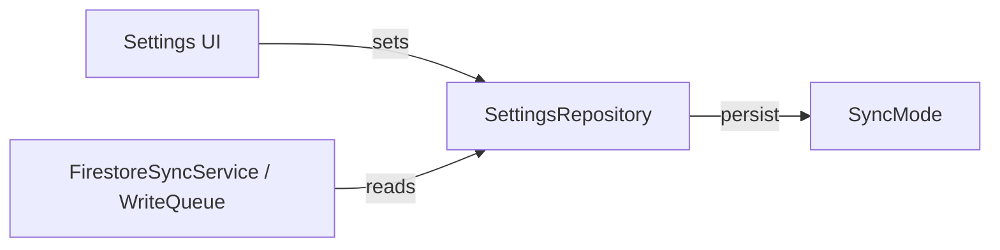

**Team Perspective**
- **Purpose:** Represents the app's synchronization strategy between local storage and remote Firestore.

**Developer Perspective**
- **Language:** Dart
- **Location:** `lib/core/sync_mode.dart`

Function Catalog
- **`enum SyncMode { localOnly, sync, remoteOnly }`** — the three supported sync policies.
- **`SyncModeExtension.toKey(): String`** — converts the enum to a stable string key for storage.
- **`SyncModeExtension.fromKey(String? key): SyncMode`** — parses a stored key back into a `SyncMode` (defaults to `sync`).

Side Effects
- Pure in-memory enum helpers; no side effects. Values are intended to be persisted by `SettingsRepository` and read by sync services.

Designer Perspective
- **User-facing effect:** Changes the app's synchronization behaviour: `localOnly` disables remote sync, `sync` uses the write-queue and firestore sync service, `remoteOnly` prefers remote storage (useful for testing or diagnostics).

Visual Mapping

```
