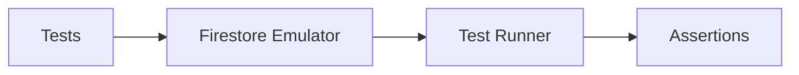

**The Team Perspective:**
- Purpose: Integration tests rely on the Firestore emulator for predictable behavior. Use the provided scripts to run emulator + tests locally.

**The Developer Perspective:**
- Key scripts (in `scripts/`):
  - Windows helper: `scripts/run_emulator_and_tests.ps1 -TestPath 'test/integration'`
  - Run with local Firebase env: `scripts/run-with-firebase.ps1`
- CI/local steps:
  1. `cd housekeepr`
  2. `flutter pub get`
  3. Start Firestore emulator (or use the helper script)
  4. `FIRESTORE_EMULATOR_HOST=localhost:8080 flutter test`

**The Designer Perspective:**
- Test flows should cover household join flows and write-queue retry behavior to ensure UX remains consistent during emulated network issues.

**Visual Mapping:**
