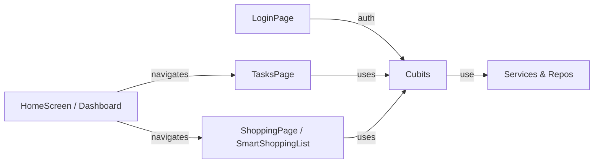

**Team Perspective**
- **Purpose:** UI pages and widgets implement the app's user-facing flows: onboarding/login, household creation/joining, the main home dashboard, task and shopping list management, and settings/profile interactions.

**Developer Perspective**
- **Language:** Dart (Flutter)
- **Location:** `lib/ui/`

Core Pages (high level)
- **`LoginPage`** (`login_page.dart`) — authentication entry: Google sign-in flows that talk directly to `FirebaseAuth` and `GoogleSignIn`, then call the provided `onSignedIn` callback.
- **`HouseholdCreatePage`** (`household_create_page.dart`) — create/join household flows; writes directly to Firestore `households` and `users` documents, then calls back with the created/joined household ID.
- **`TasksPage`** (`tasks_page.dart`) — lists tasks from `TaskCubit`, supports add/edit/complete actions and reminders.
- **`ShoppingPage`** (`shopping_page.dart`) & **`SmartShoppingListPage`** (`smart_shopping_list_page.dart`) — shopping list UIs that bind to the shopping cubits and provide add/reorder/toggle behaviors; v2 uses `GroceryItem` + auto-category suggestions.

Root App Shell
- `home_screen.dart` is documented separately in [app-root.md](app-root.md); it is not part of the `lib/ui/` folder.

Common Widgets
- `task_card.dart` — task list item with action buttons and status.
- `empty_state.dart` — a reusable empty-state placeholder for lists.
- `skeleton_loader.dart` — loading skeleton placeholder used while content loads.
- Dialogs: `task_add_dialog.dart`, `shopping_add_dialog.dart`, `shopping_add_product_dialog.dart` — small, focused input flows that return created objects to calling pages.

Integration Notes
- UI pages listen to Cubits for state and call cubit methods for actions. Pages should not call repositories directly — prefer cubit wrappers. Many dialogs return values that the page then sends to the cubit for persistence and remote enqueueing.

Designer Perspective
- Pages should reflect cubit states: loading, empty, populated, error. Optimistic updates are common (cubits emit before persistence), so UI must support transient in-flight states.

Visual Mapping

