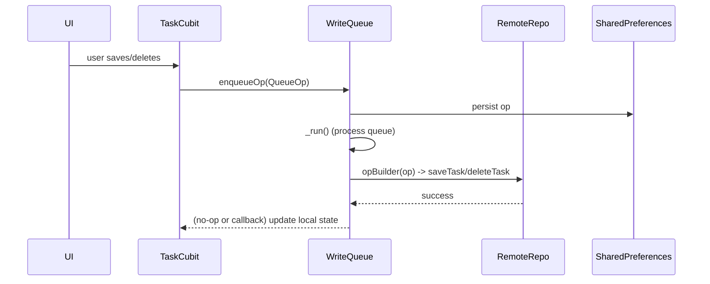

**The Team Perspective:**
- Purpose: `WriteQueue` persistently records user-intended changes (save/delete) so they can be retried and applied to Firestore reliably, even across app restarts and network failures.

**The Developer Perspective:**
- Core types and API (Dart):
  - `enum QueueOpType { saveTask, deleteTask, saveShopping, deleteShopping, saveHistory, deleteHistory, saveGrocery, deleteGrocery }`
  - `class QueueOp { QueueOpType type; String id; Map<String,dynamic>? payload; int attempts; }`
  - Public methods:
    - `WriteQueue(SharedPreferences prefs)` — constructs the queue and loads from prefs.
    - `void setUserId(String? uid)` — scope persisted queue to a user-key and load it.
    - `void enqueueOp(QueueOp op)` — persist and schedule processing.
    - `void attachOpBuilder(AsyncOp Function(QueueOp op)? builder)` — provide concrete repo actions.
    - `void attachFailureHandler(void Function(QueueOp op, Object? lastError)? h)` — handle persistent failures.
    - `Set<String> getPendingDeleteTaskIds()` — helper to hide locally-deleted tasks in the UI.

**Function Catalog:**
- `WriteQueue(SharedPreferences prefs): WriteQueue` — Constructor that loads persisted queue from `SharedPreferences` and prepares in-memory queue.
  Side effects: reads from `SharedPreferences` and may schedule processing if an op builder is attached.
- `void setUserId(String? uid)` — Set the active user id for per-user queue scoping, migrate global queue if needed.
  Side effects: reads/writes `SharedPreferences` and may clear in-memory queue when `null`.
- `void enqueueOp(QueueOp op)` — Persist and enqueue a `QueueOp` for retryable processing.
  Side effects: writes to `SharedPreferences` and triggers queue processing.
- `void enqueue(AsyncOp op)` — Enqueue a non-persistent asynchronous operation (runs with retries but is not persisted).
  Side effects: executes the provided `AsyncOp` and may delay/retry on failure.
- `void attachOpBuilder(AsyncOp Function(QueueOp op)? builder)` — Attach or detach the builder that maps `QueueOp` to concrete `AsyncOp` for remote calls.
  Side effects: may start or stop queue processing depending on `builder` presence.
- `void attachFailureHandler(void Function(QueueOp op, Object? lastError)? h)` — Register a handler for persistent failures after retries.
  Side effects: none until invoked on failure.
- `Set<String> getPendingDeleteTaskIds()` — Returns the set of task IDs currently queued for deletion.
  Side effects: none.

- Persistence and behavior:
  - Stored in `SharedPreferences` under key `_kKey` or `${_kKey}_$userId`.
  - Retries ops up to ~5 attempts with exponential backoff.
  - `_run()` processing requires an attached `_opBuilder` — `attachOpBuilder` is typically called from `main.dart` with a builder that maps `QueueOpType` to repository calls.

- Example (from `main.dart`): the op builder switch maps `saveTask` -> `remoteTask.saveTask(task)` and `deleteTask` to `remoteTask.deleteTask(id)` (household vs user routing is handled there).

**The Designer Perspective:**
- The UI should optimistically reflect saves/deletes immediately and use `getPendingDeleteTaskIds()` to hide client-deleted items until the server confirms deletion.
- On persistent failure, the failure handler may surface a snackbar or show a retry UI.

**Visual Mapping:**

